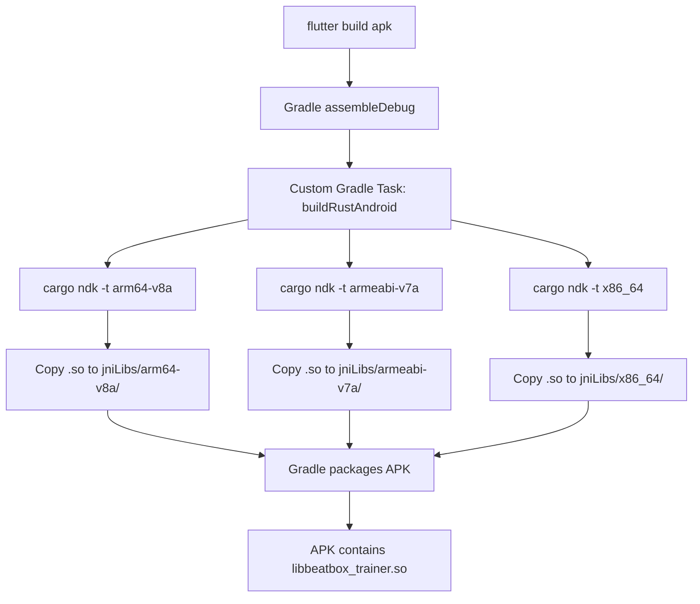
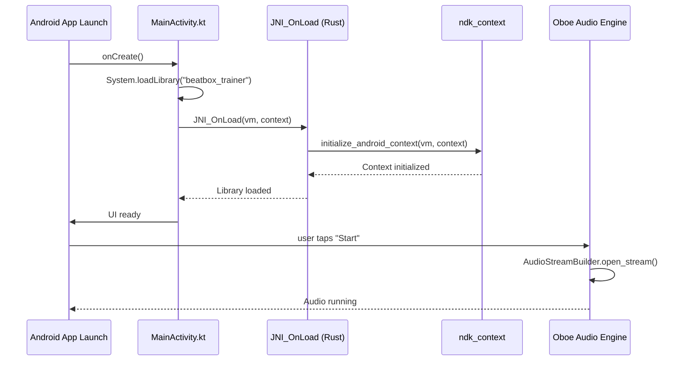

# Design Document: Android Build Integration

## Overview

This design establishes the complete Android build infrastructure for the beatbox trainer application, addressing critical compilation failures that prevent the Rust audio engine from building for Android targets. The solution integrates cargo-ndk into the Flutter build pipeline, fixes Android-specific API incompatibilities in the audio callback and JNI initialization code, and ensures the native library (libbeatbox_trainer.so) is correctly packaged and loaded at runtime.

The implementation maintains the existing 4-layer native-first architecture (C++ Oboe → Rust → Java/JNI → Dart/Flutter) while adding the necessary platform-specific adaptations to make it functional on Android hardware.

## Steering Document Alignment

### Technical Standards (tech.md)

- **Native-First Architecture Preservation**: Maintains the 4-layer stack without introducing high-level audio plugins
- **Real-Time Safety**: All fixes preserve lock-free, allocation-free audio callback guarantees
- **Cross-Compilation**: Uses cargo-ndk (documented as required tool) with NDK r25c+ for ARM/ARM64 targets
- **JNI Integration**: Implements the documented "Manual JNI_OnLoad" pattern required for Flutter+Oboe apps
- **Performance Targets**: No regression - maintains < 20ms audio latency goal

### Project Structure (structure.md)

- **Android Isolation**: All Android-specific code confined to `android/` directory and conditional compilation blocks
- **Build Configuration**: Gradle integration follows existing `android/app/build.gradle.kts` structure
- **Module Boundaries**: Audio layer (Rust) remains independent of UI layer (Dart) per documented separation
- **Documentation Standards**: Inline comments explain Android-specific JNI/NDK requirements

## Code Reuse Analysis

### Existing Components to Leverage

- **Error Handling (`rust/src/error.rs`)**: Extend `AudioError` enum with Android-specific errors (`JniInitFailed`, `ContextNotInitialized`)
- **Build Scripts (`rust/build.rs`)**: Add Android target detection logic to existing build script
- **MainActivity (`android/app/src/main/kotlin/MainActivity.kt`)**: Extend existing `init` block to load native library

### Integration Points

- **Flutter Build System**: Hook into existing `flutter build apk` via Gradle task dependencies
- **Oboe Library (`oboe-rs`)**: Fix callback trait implementation to satisfy v0.6.x API changes
- **ndk-context Initialization**: Integrate with existing `lib.rs` JNI_OnLoad infrastructure

## Architecture

### Build Pipeline Architecture



### Runtime Initialization Flow



### Modular Design Principles

- **Conditional Compilation**: Use `#[cfg(target_os = "android")]` to isolate Android-specific code, keeping non-Android builds clean
- **Build Script Modularity**: Separate cargo-ndk invocation logic into reusable Gradle task (can be shared across future Rust modules)
- **Error Propagation**: Android initialization errors flow through existing `Result<T, AudioError>` pattern
- **Platform Detection**: Rust `build.rs` detects Android target and configures oboe feature flags appropriately

## Components and Interfaces

### Component 1: Gradle Rust Build Task

**File**: `android/app/build.gradle.kts`

- **Purpose:** Automate cargo-ndk cross-compilation during Flutter build process
- **Interfaces:**
  ```kotlin
  task("buildRustAndroid") {
      doLast {
          // Execute cargo ndk for each architecture
          exec { commandLine("cargo", "ndk", ...) }
          // Copy .so files to jniLibs
      }
  }
  ```
- **Dependencies:**
  - Requires `cargo-ndk` installed on build machine
  - Depends on Gradle `preBuild` task
- **Reuses:** Existing `android.defaultConfig` for architecture list

### Component 2: Fixed Oboe Audio Callback

**File**: `rust/src/audio/engine.rs`

- **Purpose:** Implement audio output callback compatible with oboe-rs v0.6.x `AudioOutputCallback` trait
- **Interfaces:**
  ```rust
  struct OutputCallback {
      frame_counter: Arc<AtomicU64>,
      bpm: Arc<AtomicU32>,
      // ... existing fields
  }

  impl AudioOutputCallback for OutputCallback {
      type FrameType = (f32, oboe::Mono);

      fn on_audio_ready(
          &mut self,
          _stream: &mut dyn AudioOutputStreamSafe,
          frames: &mut [f32]
      ) -> DataCallbackResult {
          // Existing metronome logic
      }
  }
  ```
- **Dependencies:** `oboe::AudioOutputCallback`, `oboe::DataCallbackResult`
- **Reuses:** Existing metronome generation logic from `audio/metronome.rs`

### Component 3: ndk-context Initialization

**File**: `rust/src/lib.rs`

- **Purpose:** Initialize Android context when JNI_OnLoad is called
- **Interfaces:**
  ```rust
  #[cfg(target_os = "android")]
  #[no_mangle]
  pub extern "C" fn JNI_OnLoad(vm: jni::JavaVM, _reserved: *mut std::os::raw::c_void) -> jni::sys::jint {
      // Get application context from JavaVM
      let env = vm.get_env().unwrap();
      let ctx = env.call_static_method(...);

      // Initialize ndk_context with both parameters
      unsafe {
          ndk_context::initialize_android_context(
              vm.get_java_vm_pointer() as *mut _,
              ctx.l().unwrap().into_raw() as *mut _
          );
      }
      jni::sys::JNI_VERSION_1_6
  }
  ```
- **Dependencies:** `jni` crate, `ndk-context` crate
- **Reuses:** None (new Android-specific initialization)

### Component 4: MainActivity Library Loading

**File**: `android/app/src/main/kotlin/MainActivity.kt`

- **Purpose:** Load native library and provide application context to JNI layer
- **Interfaces:**
  ```kotlin
  class MainActivity: FlutterActivity() {
      companion object {
          init {
              System.loadLibrary("beatbox_trainer")
          }
      }
  }
  ```
- **Dependencies:** Android SDK, Kotlin stdlib
- **Reuses:** Existing FlutterActivity base class

### Component 5: Android-Specific Error Types

**File**: `rust/src/error.rs`

- **Purpose:** Extend error handling to cover Android initialization failures
- **Interfaces:**
  ```rust
  #[derive(Debug, Clone, PartialEq)]
  pub enum AudioError {
      // ... existing variants
      JniInitFailed { reason: String },
      ContextNotInitialized,
  }

  impl ErrorCode for AudioError {
      fn code(&self) -> i32 {
          match self {
              // ... existing codes 1001-1007
              AudioError::JniInitFailed { .. } => 1008,
              AudioError::ContextNotInitialized => 1009,
          }
      }
  }
  ```
- **Dependencies:** Existing `ErrorCode` trait
- **Reuses:** Existing error handling infrastructure from `rust/src/error.rs`

## Data Models

### Build Configuration Model

**File**: `android/app/build.gradle.kts`

```kotlin
android {
    defaultConfig {
        ndk {
            abiFilters += listOf("arm64-v8a", "armeabi-v7a", "x86_64")
        }
    }
}

// Custom properties for Rust build
val rustTargets = mapOf(
    "arm64-v8a" to "aarch64-linux-android",
    "armeabi-v7a" to "armv7-linux-androideabi",
    "x86_64" to "x86_64-linux-android"
)
```

### JNI Context Model

**File**: `rust/src/lib.rs`

```rust
#[cfg(target_os = "android")]
static ANDROID_CONTEXT_INITIALIZED: AtomicBool = AtomicBool::new(false);

// Tracks whether Android context was successfully initialized
// Used to provide better error messages if audio engine starts before init
```

## Error Handling

### Error Scenario 1: cargo-ndk Not Installed

- **Handling:** Gradle task `buildRustAndroid` checks for `cargo-ndk` binary, fails with clear error message if missing
- **User Impact:** Developer sees: "cargo-ndk not found. Install with: cargo install cargo-ndk"
- **Recovery:** User installs cargo-ndk and retries build

### Error Scenario 2: JNI Context Initialization Fails

- **Handling:** `JNI_OnLoad` logs error to logcat and returns `JNI_VERSION_1_6` (Android continues but audio will fail later with `AudioError::ContextNotInitialized`)
- **User Impact:** App launches but crashes when user taps "Start" button, with error dialog: "Audio engine initialization failed (code 1009)"
- **Recovery:** Check device compatibility (requires Android 7.0+), check logcat for detailed JNI error

### Error Scenario 3: Native Library Missing from APK

- **Handling:** `System.loadLibrary()` throws `UnsatisfiedLinkError`, caught by Flutter error boundary
- **User Impact:** App shows error screen: "Native library not found. Please reinstall the app."
- **Recovery:** Developer checks `unzip -l app-debug.apk` to verify .so files present, ensures build completed successfully

### Error Scenario 4: Oboe Callback Trait Mismatch

- **Handling:** Compilation fails with clear error message pointing to `engine.rs:153` callback definition
- **User Impact:** Developer sees compiler error with trait bound requirements
- **Recovery:** Follow compiler suggestion to implement `AudioOutputCallback` trait correctly

### Error Scenario 5: Architecture Mismatch

- **Handling:** Android Package Manager logs warning "Unable to load native library for ABI", falls back to alternative architecture if available
- **User Impact:** None if APK contains multiple architectures; app runs on fallback ABI (armeabi-v7a on ARM64 device)
- **Recovery:** Ensure all required architectures are built and packaged

## Testing Strategy

### Unit Testing

- **Rust Build Script Test**: Add `#[test]` in `build.rs` to verify Android target detection logic
- **Error Code Test**: Extend `rust/src/error.rs` tests to cover new Android error variants (1008, 1009)
- **JNI Initialization Mock**: Create test harness that simulates `JNI_OnLoad` call with mock JavaVM

### Integration Testing

- **Gradle Task Test**: Run `./gradlew buildRustAndroid` standalone to verify cargo-ndk invocation and .so file copying
- **APK Packaging Test**: Use `unzip -l build/app/outputs/flutter-apk/app-debug.apk | grep libbeatbox_trainer.so` to verify all architectures present
- **Library Loading Test**: Create minimal Android test app that calls `System.loadLibrary("beatbox_trainer")` and verifies no `UnsatisfiedLinkError`

### End-to-End Testing

- **Physical Device Test (Pixel 9a)**:
  1. Connect device via USB with debugging enabled
  2. Run `flutter run -d 4C041JEBF15065`
  3. Verify app launches without crashes
  4. Tap "Start" button
  5. Verify no `ContextNotInitialized` error
  6. Verify audio callback begins executing (check logcat for metronome timing logs)

- **Emulator Test (x86_64)**:
  1. Launch Android emulator (API 30+)
  2. Run `flutter run -d emulator-5554`
  3. Verify app launches and x86_64 .so is loaded
  4. Verify audio permissions granted
  5. Verify audio engine starts successfully

- **Build Reproducibility Test**:
  1. Clean build: `flutter clean && flutter build apk`
  2. Incremental build: Touch `rust/src/api.rs`, run `flutter build apk`
  3. Verify Rust recompilation triggered and .so updated in APK
  4. Verify build time < 30 seconds for incremental rebuild

### Performance Testing

- **Audio Latency Measurement**:
  1. Connect audio loopback cable (microphone output → speaker input)
  2. Start app and metronome
  3. Record latency using external audio analysis tool
  4. Verify < 20ms round-trip latency maintained after Android integration

- **Build Time Benchmark**:
  1. Full clean build: `time flutter clean && time flutter build apk`
  2. Verify total time < 5 minutes
  3. Rust-only change: `touch rust/src/audio/engine.rs && time flutter build apk`
  4. Verify incremental build < 30 seconds
