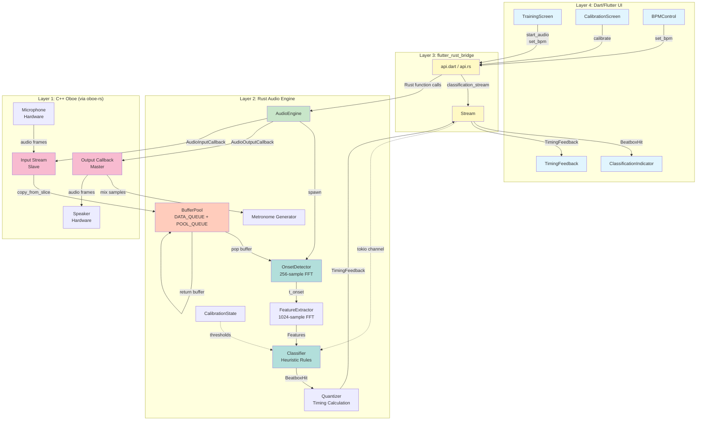
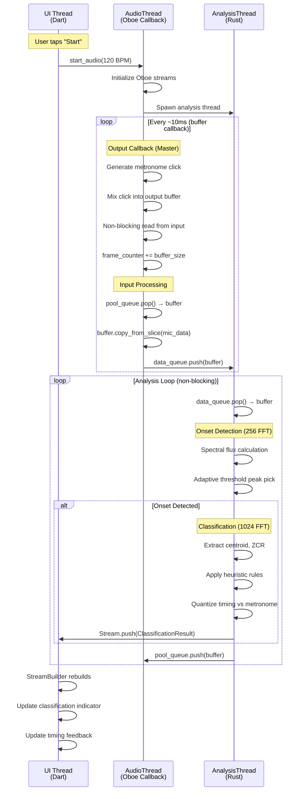

# Design Document

## Overview

The Beatbox Trainer Core implements a real-time rhythm training system using a 4-layer native architecture specifically designed for uncompromising audio performance. The system processes audio through a sophisticated pipeline: C++ Oboe handles low-latency I/O, Rust performs lock-free DSP analysis, and Flutter provides responsive UI feedback. This design eliminates the fundamental limitations of high-level audio frameworks (latency, jitter, GC pauses) while maintaining code safety through Rust's ownership model.

The architecture employs three concurrent threads with strict real-time constraints: an AudioThread (must complete within buffer duration), an AnalysisThread (processes DSP with no time bounds), and a UI Thread (React to results with < 100ms latency). Communication between threads uses lock-free SPSC queues with pre-allocated buffer pools, ensuring zero allocations in the audio path. This design delivers sample-accurate metronome generation (0 jitter) and sub-20ms end-to-end latency.

## Steering Document Alignment

### Technical Standards (tech.md)

**4-Layer Stack Implementation**:
- Layer 1 (C++ Oboe): Implemented via `oboe-rs` crate with full-duplex master-slave pattern
- Layer 2 (Rust): Audio engine in `rust/src/`, three sub-modules (audio/, analysis/, calibration/)
- Layer 3 (flutter_rust_bridge): Auto-generated bindings in `lib/bridge/api.dart` and `rust/src/api.rs`
- Layer 4 (Dart/Flutter): UI screens in `lib/ui/screens/`, widgets in `lib/ui/widgets/`

**Lock-Free Architecture**:
- `rtrb::RingBuffer` for DATA_QUEUE and POOL_QUEUE
- Dual-queue object pool pattern prevents allocations
- Audio callback uses only `copy_from_slice()` and modulo arithmetic

**Heuristic DSP Approach**:
- `aus` crate for spectral centroid and ZCR extraction
- `rustfft` for 256-sample (onset) and 1024-sample (classification) FFTs
- Custom adaptive thresholding logic in `analysis/onset.rs`

**JNI Initialization**:
- Manual `JNI_OnLoad` implementation in `rust/src/lib.rs`
- `MainActivity.kt` init block calls `System.loadLibrary("beatbox_trainer")`
- `ndk_context::initialize_android_context()` invoked before Oboe usage

### Project Structure (structure.md)

**Directory Organization**:
```
lib/
├── main.dart                    # Entry point
├── ui/
│   ├── screens/
│   │   ├── calibration_screen.dart
│   │   └── training_screen.dart
│   └── widgets/
│       ├── classification_indicator.dart
│       ├── timing_feedback.dart
│       └── bpm_control.dart
├── bridge/
│   └── api.dart                 # flutter_rust_bridge generated
└── models/
    ├── classification_result.dart
    ├── timing_feedback.dart
    └── calibration_state.dart

rust/src/
├── lib.rs                       # JNI_OnLoad, crate root
├── api.rs                       # Public API (@frb annotations)
├── audio/
│   ├── mod.rs
│   ├── engine.rs                # AudioEngine struct, Oboe callbacks
│   ├── metronome.rs             # Sample-accurate click generation
│   └── buffer_pool.rs           # SPSC queue + pool pattern
├── analysis/
│   ├── mod.rs
│   ├── onset.rs                 # Spectral flux onset detection
│   ├── features.rs              # DSP feature extraction
│   ├── classifier.rs            # Heuristic classification rules
│   └── quantizer.rs             # Timing quantization logic
└── calibration/
    ├── mod.rs
    ├── state.rs                 # CalibrationState struct
    └── procedure.rs             # Calibration workflow
```

**Naming Conventions**:
- Rust: `snake_case` modules, `PascalCase` structs, `UPPER_SNAKE_CASE` constants
- Dart: `snake_case` files, `PascalCase` classes, `camelCase` methods
- Kotlin: `PascalCase` classes, `camelCase` methods

**Real-Time Safety Checklist Applied**:
- No heap allocations in `audio/engine.rs` callbacks
- No locks in `audio/` module
- All buffers pre-allocated in `buffer_pool.rs`

## Code Reuse Analysis

### Existing Components to Leverage

**From Flutter Ecosystem**:
- **Material Design widgets**: `Scaffold`, `AppBar`, `FloatingActionButton` for base UI structure
- **StreamBuilder**: Reactive UI updates from Rust Stream
- **Slider**: BPM control widget (40-240 range)

**From Rust Crate Ecosystem**:
- **oboe-rs** (v0.6): Complete Oboe bindings, no custom wrapper needed
- **rtrb** (v0.3): Production-ready SPSC queue, proven in audio applications
- **rustfft** (v6): Fastest pure-Rust FFT, no need for custom implementation
- **aus** or **estratto**: Feature extraction functions already implemented

**From Android SDK**:
- **Permissions API**: Runtime RECORD_AUDIO permission flow (Flutter plugin: `permission_handler`)
- **Audio Manager**: Query device latency characteristics via platform channel

### Integration Points

**Flutter ↔ Rust Bridge**:
- `flutter_rust_bridge_codegen` generates bidirectional bindings automatically
- Rust functions annotated with `#[flutter_rust_bridge::frb]` become callable from Dart
- Rust `Stream<T>` becomes Dart `Stream<T>` (async iteration in UI)

**Oboe ↔ Android Audio Hardware**:
- Oboe automatically selects best backend (AAudio on Android 8.1+, OpenSL ES fallback)
- No manual backend selection required

**Audio Thread ↔ Analysis Thread**:
- `rtrb::Producer`/`Consumer` split ownership (Send + Sync bounds)
- Audio thread owns `Producer`, Analysis thread owns `Consumer`

## Architecture

### Modular Design Principles

**Single File Responsibility**:
- `audio/engine.rs`: Audio I/O lifecycle only (no DSP logic)
- `analysis/onset.rs`: Onset detection only (no classification)
- `calibration/state.rs`: Threshold storage only (no measurement)

**Component Isolation**:
- Each Rust module is self-contained (no circular dependencies)
- Each Dart screen is independent (no shared mutable state)

**Service Layer Separation**:
- Audio layer provides raw audio streams
- Analysis layer provides DSP results
- UI layer presents results (no business logic)

**Utility Modularity**:
- `audio/buffer_pool.rs`: Reusable lock-free pool pattern
- `analysis/features.rs`: Pure functions for DSP calculations

### System Architecture Diagram



### Thread Architecture Diagram



## Components and Interfaces

### Component 1: AudioEngine (Rust)

**Purpose**: Manages Oboe audio streams, metronome generation, and lock-free data transfer to analysis thread.

**File**: `rust/src/audio/engine.rs`

**Interfaces**:
```rust
pub struct AudioEngine {
    output_stream: Option<AudioStreamAsync<Output>>,
    input_stream: Option<AudioStreamAsync<Input>>,
    sample_rate: u32,
    frame_counter: Arc<AtomicU64>,
    bpm: Arc<AtomicU32>,
    data_producer: Producer<Vec<f32>>,
    pool_consumer: Consumer<Vec<f32>>,
}

impl AudioEngine {
    pub fn new(bpm: u32) -> Result<Self, AudioError>;
    pub fn start(&mut self) -> Result<(), AudioError>;
    pub fn stop(&mut self) -> Result<(), AudioError>;
    pub fn set_bpm(&self, bpm: u32);
}

// Oboe callbacks
impl AudioOutputCallback for AudioEngine {
    fn on_audio_ready(&mut self, stream: &mut AudioOutputStreamSafe, audio_data: &mut [f32]) -> DataCallbackResult;
}
```

**Dependencies**:
- `oboe` crate: Audio stream management
- `audio/metronome.rs`: Click generation function
- `audio/buffer_pool.rs`: SPSC queue setup
- `std::sync::atomic`: Atomic BPM and frame counter

**Reuses**:
- `oboe-rs` FullDuplexStream pattern (documented in Oboe samples)
- `rtrb` lock-free queue (standard pattern in audio applications)

**Real-Time Safety**:
- `on_audio_ready` uses only:
  - Atomic loads (`bpm.load(Ordering::Relaxed)`)
  - Modulo arithmetic (`frame_counter % samples_per_beat`)
  - `pool_consumer.pop()` (lock-free, returns `Err` if empty)
  - `data_producer.push()` (lock-free, returns `Err` if full)
  - `copy_from_slice()` (no allocations)

### Component 2: BufferPool (Rust)

**Purpose**: Implements lock-free buffer pool pattern using dual SPSC queues to eliminate allocations in audio thread.

**File**: `rust/src/audio/buffer_pool.rs`

**Interfaces**:
```rust
pub struct BufferPool {
    data_queue: (Producer<Vec<f32>>, Consumer<Vec<f32>>),
    pool_queue: (Producer<Vec<f32>>, Consumer<Vec<f32>>),
}

impl BufferPool {
    pub fn new(buffer_count: usize, buffer_size: usize) -> Self;
    pub fn split(self) -> (
        (Producer<Vec<f32>>, Consumer<Vec<f32>>),  // DATA_QUEUE
        (Producer<Vec<f32>>, Consumer<Vec<f32>>),  // POOL_QUEUE
    );
}
```

**Dependencies**:
- `rtrb` crate: Lock-free SPSC ring buffers

**Reuses**:
- Standard object pool pattern from game development and audio processing

**Initialization**:
```rust
let pool = BufferPool::new(16, 2048);  // 16 buffers × 2048 samples
let ((data_prod, data_cons), (pool_prod, pool_cons)) = pool.split();

// Pre-fill pool with empty buffers
for _ in 0..16 {
    pool_prod.push(vec![0.0f32; 2048]).unwrap();
}

// Give data_prod to AudioEngine
// Give data_cons to AnalysisThread
// Give pool_prod to AnalysisThread
// Give pool_cons to AudioEngine
```

### Component 3: OnsetDetector (Rust)

**Purpose**: Detects sound onset timestamps using spectral flux algorithm with adaptive thresholding.

**File**: `rust/src/analysis/onset.rs`

**Interfaces**:
```rust
pub struct OnsetDetector {
    fft_planner: Arc<Mutex<FftPlanner<f32>>>,  // Locked ONLY in Analysis thread
    prev_spectrum: Vec<f32>,
    flux_signal: VecDeque<f32>,
    sample_rate: u32,
    window_size: usize,  // 256 samples
}

impl OnsetDetector {
    pub fn new(sample_rate: u32) -> Self;
    pub fn process(&mut self, audio: &[f32]) -> Vec<u64> {
        // Returns onset timestamps (in sample count since engine start)
    }

    fn compute_spectral_flux(&self, spectrum: &[f32]) -> f32;
    fn adaptive_threshold(&self, window_size: usize) -> f32;
    fn pick_peaks(&self, signal: &[f32], threshold: f32) -> Vec<usize>;
}
```

**Dependencies**:
- `rustfft` or `microfft`: FFT computation
- `std::collections::VecDeque`: Circular buffer for flux signal

**Reuses**:
- Spectral flux algorithm (standard in MIR literature)
- Adaptive thresholding (median + offset pattern)

**Algorithm**:
1. Compute 256-point FFT with 75% overlap (hop = 64 samples)
2. Calculate magnitude spectrum: `|FFT[k]|`
3. Compute positive difference from previous frame: `SF[k] = max(0, |FFT_t[k]| - |FFT_(t-1)[k]|)`
4. Sum across frequency bins: `flux_t = Σ SF[k]`
5. Apply adaptive threshold: `threshold_t = median(flux[t-50:t+50]) + 0.1`
6. Peak pick: Find local maxima where `flux_t > threshold_t`

### Component 4: FeatureExtractor (Rust)

**Purpose**: Extracts DSP features (spectral centroid, ZCR, flatness, rolloff) from onset windows for classification.

**File**: `rust/src/analysis/features.rs`

**Interfaces**:
```rust
pub struct Features {
    pub centroid: f32,           // Hz (spectral brightness)
    pub zcr: f32,                // 0-1 (noisiness)
    pub flatness: f32,           // 0-1 (tonality vs noise) [Level 2]
    pub rolloff: f32,            // Hz (85% energy threshold) [Level 2]
    pub decay_time_ms: f32,      // ms (envelope decay) [Level 2]
}

pub struct FeatureExtractor {
    fft_planner: Arc<Mutex<FftPlanner<f32>>>,
    sample_rate: u32,
    window_size: usize,  // 1024 samples
}

impl FeatureExtractor {
    pub fn new(sample_rate: u32) -> Self;
    pub fn extract(&mut self, audio_window: &[f32]) -> Features;

    fn compute_centroid(spectrum: &[f32], sample_rate: u32) -> f32;
    fn compute_zcr(audio: &[f32]) -> f32;
    fn compute_flatness(spectrum: &[f32]) -> f32;
    fn compute_rolloff(spectrum: &[f32], sample_rate: u32, threshold: f32) -> f32;
    fn compute_decay_time(audio: &[f32], sample_rate: u32) -> f32;
}
```

**Dependencies**:
- `rustfft`: 1024-point FFT for classification
- `aus` or `estratto`: Pre-implemented feature functions (optional, can be custom)

**Reuses**:
- Standard MIR feature definitions (centroid = weighted mean of spectrum)
- ZCR formula from audio textbooks

**Feature Formulas**:
- **Centroid**: `Σ(f_i × |X[i]|) / Σ|X[i]|` where `f_i = i × (sample_rate / FFT_size)`
- **ZCR**: `(1/N) Σ |sign(x[n]) - sign(x[n-1])|`
- **Flatness**: `exp((1/N) Σ log|X[k]|) / ((1/N) Σ |X[k]|)` (geometric mean / arithmetic mean)
- **Rolloff**: Frequency where `Σ_{k=0}^{k_r} |X[k]| = 0.85 × Σ_{k=0}^{N} |X[k]|`
- **Decay Time**: Fit exponential to RMS envelope, measure time to -20dB

### Component 5: Classifier (Rust)

**Purpose**: Applies heuristic rules to classify sounds as KICK/SNARE/HIHAT/UNKNOWN based on calibrated thresholds.

**File**: `rust/src/analysis/classifier.rs`

**Interfaces**:
```rust
#[derive(Debug, Clone, PartialEq)]
pub enum BeatboxHit {
    Kick,
    Snare,
    HiHat,
    Unknown,
    // Level 2 subcategories:
    ClosedHiHat,
    OpenHiHat,
    KSnare,
}

pub struct Classifier {
    level: ClassificationLevel,
    calibration: Arc<RwLock<CalibrationState>>,  // Read-only in analysis thread
}

impl Classifier {
    pub fn new(calibration: Arc<RwLock<CalibrationState>>) -> Self;
    pub fn classify(&self, features: &Features) -> BeatboxHit;

    fn classify_level1(&self, features: &Features) -> BeatboxHit;
    fn classify_level2(&self, features: &Features) -> BeatboxHit;
}
```

**Dependencies**:
- `calibration::CalibrationState`: Threshold values

**Reuses**:
- Decision tree pattern from ML literature (but hardcoded, not learned)

**Level 1 Rules** (from requirements):
```rust
fn classify_level1(&self, features: &Features) -> BeatboxHit {
    let cal = self.calibration.read().unwrap();

    if features.centroid < cal.t_kick_centroid && features.zcr < cal.t_kick_zcr {
        BeatboxHit::Kick
    } else if features.centroid < cal.t_snare_centroid {
        BeatboxHit::Snare
    } else if features.centroid >= cal.t_snare_centroid && features.zcr > cal.t_hihat_zcr {
        BeatboxHit::HiHat
    } else {
        BeatboxHit::Unknown
    }
}
```

**Level 2 Rules**:
- Use additional features (flatness, decay_time) to split broad categories into subcategories
- Example: HiHat → ClosedHiHat (decay < 50ms) or OpenHiHat (decay > 150ms)

### Component 6: Quantizer (Rust)

**Purpose**: Calculates timing error between onset and metronome grid, classifies as ON_TIME/EARLY/LATE.

**File**: `rust/src/analysis/quantizer.rs`

**Interfaces**:
```rust
#[derive(Debug, Clone)]
pub enum TimingClassification {
    OnTime,
    Early,
    Late,
}

#[derive(Debug, Clone)]
pub struct TimingFeedback {
    pub classification: TimingClassification,
    pub error_ms: f32,
}

pub struct Quantizer {
    frame_counter: Arc<AtomicU64>,  // Shared with AudioEngine
    bpm: Arc<AtomicU32>,            // Shared with AudioEngine
    sample_rate: u32,
}

impl Quantizer {
    pub fn new(frame_counter: Arc<AtomicU64>, bpm: Arc<AtomicU32>, sample_rate: u32) -> Self;
    pub fn quantize(&self, onset_timestamp: u64) -> TimingFeedback;
}
```

**Dependencies**:
- Shared atomic references to `frame_counter` and `bpm` from AudioEngine

**Reuses**:
- Standard phase vocoder quantization logic

**Algorithm**:
```rust
pub fn quantize(&self, onset_timestamp: u64) -> TimingFeedback {
    let bpm = self.bpm.load(Ordering::Relaxed);
    let samples_per_beat = (self.sample_rate as f64 * 60.0) / bpm as f64;

    let beat_error = (onset_timestamp as f64) % samples_per_beat;
    let error_ms = (beat_error / self.sample_rate as f64) * 1000.0;

    let beat_period_ms = (60.0 / bpm as f64) * 1000.0;
    let tolerance_ms = 50.0;

    let classification = if error_ms < tolerance_ms {
        TimingClassification::OnTime
    } else if error_ms > (beat_period_ms - tolerance_ms) {
        TimingClassification::Early
    } else {
        TimingClassification::Late
    };

    TimingFeedback { classification, error_ms: error_ms as f32 }
}
```

### Component 7: CalibrationState (Rust)

**Purpose**: Stores user-calibrated thresholds for classification.

**File**: `rust/src/calibration/state.rs`

**Interfaces**:
```rust
#[derive(Debug, Clone)]
pub struct CalibrationState {
    pub t_kick_centroid: f32,    // Hz
    pub t_kick_zcr: f32,          // 0-1
    pub t_snare_centroid: f32,    // Hz
    pub t_hihat_zcr: f32,         // 0-1
    pub is_calibrated: bool,
}

impl CalibrationState {
    pub fn new_default() -> Self {
        // Default thresholds (before calibration)
        Self {
            t_kick_centroid: 1500.0,
            t_kick_zcr: 0.1,
            t_snare_centroid: 4000.0,
            t_hihat_zcr: 0.3,
            is_calibrated: false,
        }
    }

    pub fn from_samples(kick_samples: &[Features], snare_samples: &[Features], hihat_samples: &[Features]) -> Self;
}
```

**Dependencies**: None (pure data struct)

**Reuses**: Standard statistics (mean calculation)

**Calibration Algorithm**:
```rust
pub fn from_samples(kick: &[Features], snare: &[Features], hihat: &[Features]) -> Self {
    let mean_kick_centroid = kick.iter().map(|f| f.centroid).sum::<f32>() / kick.len() as f32;
    let mean_kick_zcr = kick.iter().map(|f| f.zcr).sum::<f32>() / kick.len() as f32;

    Self {
        t_kick_centroid: mean_kick_centroid * 1.2,  // 20% margin
        t_kick_zcr: mean_kick_zcr * 1.2,
        t_snare_centroid: /* similar calculation */,
        t_hihat_zcr: /* similar calculation */,
        is_calibrated: true,
    }
}
```

### Component 8: TrainingScreen (Dart/Flutter)

**Purpose**: Main training UI with real-time classification and timing feedback display.

**File**: `lib/ui/screens/training_screen.dart`

**Interfaces**:
```dart
class TrainingScreen extends StatefulWidget {
  @override
  _TrainingScreenState createState() => _TrainingScreenState();
}

class _TrainingScreenState extends State<TrainingScreen> {
  late Stream<ClassificationResult> _classificationStream;
  bool _isTraining = false;
  int _currentBpm = 120;

  void _startTraining() async {
    await api.startAudio(bpm: _currentBpm);
    setState(() {
      _isTraining = true;
      _classificationStream = api.classificationStream();
    });
  }

  void _stopTraining() async {
    await api.stopAudio();
    setState(() => _isTraining = false);
  }

  void _setBpm(int bpm) {
    setState(() => _currentBpm = bpm);
    api.setBpm(bpm: bpm);
  }
}
```

**Dependencies**:
- `lib/bridge/api.dart`: flutter_rust_bridge generated API
- `lib/ui/widgets/classification_indicator.dart`
- `lib/ui/widgets/timing_feedback.dart`
- `lib/ui/widgets/bpm_control.dart`

**Reuses**:
- Flutter Material Design: `Scaffold`, `AppBar`, `FloatingActionButton`
- `StreamBuilder` for reactive UI updates

**Widget Tree**:
```dart
Scaffold(
  appBar: AppBar(title: Text('Beatbox Trainer')),
  body: Column([
    BPMControl(currentBpm: _currentBpm, onChanged: _setBpm),
    StreamBuilder<ClassificationResult>(
      stream: _classificationStream,
      builder: (context, snapshot) {
        if (!snapshot.hasData) return ClassificationIndicator.idle();
        return ClassificationIndicator(result: snapshot.data!);
      },
    ),
    StreamBuilder<ClassificationResult>(
      stream: _classificationStream,
      builder: (context, snapshot) {
        if (!snapshot.hasData) return TimingFeedback.idle();
        return TimingFeedback(result: snapshot.data!);
      },
    ),
  ]),
  floatingActionButton: FloatingActionButton(
    onPressed: _isTraining ? _stopTraining : _startTraining,
    child: Icon(_isTraining ? Icons.stop : Icons.play_arrow),
  ),
)
```

### Component 9: CalibrationScreen (Dart/Flutter)

**Purpose**: Guides user through calibration process (10 samples × 3 sounds = 30 samples).

**File**: `lib/ui/screens/calibration_screen.dart`

**Interfaces**:
```dart
enum CalibrationSound { kick, snare, hihat }

class CalibrationScreen extends StatefulWidget {
  @override
  _CalibrationScreenState createState() => _CalibrationScreenState();
}

class _CalibrationScreenState extends State<CalibrationScreen> {
  CalibrationSound _currentSound = CalibrationSound.kick;
  int _samplesCollected = 0;
  final int _samplesRequired = 10;

  void _startCalibration() async {
    await api.startCalibration(sound: _currentSound);
    // Listen to calibration progress stream
  }

  void _onSampleCollected() {
    setState(() {
      _samplesCollected++;
      if (_samplesCollected >= _samplesRequired) {
        _nextSound();
      }
    });
  }

  void _nextSound() {
    if (_currentSound == CalibrationSound.kick) {
      setState(() {
        _currentSound = CalibrationSound.snare;
        _samplesCollected = 0;
      });
    } else if (_currentSound == CalibrationSound.snare) {
      setState(() {
        _currentSound = CalibrationSound.hihat;
        _samplesCollected = 0;
      });
    } else {
      _finishCalibration();
    }
  }

  void _finishCalibration() async {
    await api.finishCalibration();
    Navigator.pop(context);
  }
}
```

**Dependencies**:
- `lib/bridge/api.dart`: Calibration functions
- Flutter Material: Progress indicators, instructions text

## Data Models

### Model 1: ClassificationResult (Rust ↔ Dart)

**Purpose**: Carries classification and timing feedback from Rust to Dart UI.

**Rust Definition** (`rust/src/api.rs`):
```rust
#[derive(Debug, Clone)]
pub struct ClassificationResult {
    pub sound: BeatboxHit,
    pub timing: TimingFeedback,
    pub timestamp_ms: u64,  // For logging/debugging
}
```

**Dart Definition** (`lib/models/classification_result.dart`, auto-generated):
```dart
class ClassificationResult {
  final BeatboxHit sound;
  final TimingFeedback timing;
  final int timestampMs;

  ClassificationResult({
    required this.sound,
    required this.timing,
    required this.timestampMs,
  });
}

enum BeatboxHit {
  kick,
  snare,
  hiHat,
  unknown,
}
```

### Model 2: TimingFeedback (Rust ↔ Dart)

**Rust Definition**:
```rust
#[derive(Debug, Clone)]
pub struct TimingFeedback {
    pub classification: TimingClassification,
    pub error_ms: f32,
}

#[derive(Debug, Clone, PartialEq)]
pub enum TimingClassification {
    OnTime,
    Early,
    Late,
}
```

**Dart Definition** (auto-generated):
```dart
class TimingFeedback {
  final TimingClassification classification;
  final double errorMs;
}

enum TimingClassification {
  onTime,
  early,
  late,
}
```

### Model 3: CalibrationProgress (Rust ↔ Dart)

**Purpose**: Reports calibration progress to UI.

**Rust Definition**:
```rust
#[derive(Debug, Clone)]
pub struct CalibrationProgress {
    pub current_sound: CalibrationSound,
    pub samples_collected: usize,
    pub samples_required: usize,
}

#[derive(Debug, Clone, PartialEq)]
pub enum CalibrationSound {
    Kick,
    Snare,
    HiHat,
}
```

**Dart Definition** (auto-generated):
```dart
class CalibrationProgress {
  final CalibrationSound currentSound;
  final int samplesCollected;
  final int samplesRequired;
}

enum CalibrationSound {
  kick,
  snare,
  hiHat,
}
```

## Error Handling

### Error Scenario 1: Oboe Stream Initialization Fails

**Description**: Device does not support low-latency audio (e.g., very old Android device or emulator without audio HAL).

**Rust Handling**:
```rust
impl AudioEngine {
    pub fn start(&mut self) -> Result<(), AudioError> {
        let output_stream = AudioStreamBuilder::default()
            .set_performance_mode(PerformanceMode::LowLatency)
            .set_usage(Usage::Game)  // Prioritizes latency
            .set_sharing_mode(SharingMode::Exclusive)
            .open_stream()?;  // Returns Err(oboe::Error) if fails

        if output_stream.get_buffer_size_in_frames() > 1024 {
            log::warn!("High buffer size detected: {} frames", output_stream.get_buffer_size_in_frames());
        }

        self.output_stream = Some(output_stream);
        Ok(())
    }
}

#[derive(Debug)]
pub enum AudioError {
    OboeError(oboe::Error),
    DeviceNotSupported(String),
}
```

**Dart Handling**:
```dart
try {
  await api.startAudio(bpm: 120);
} catch (e) {
  showDialog(
    context: context,
    builder: (context) => AlertDialog(
      title: Text('Audio Error'),
      content: Text('Failed to start audio engine: $e\nTry closing other audio apps.'),
      actions: [
        TextButton(
          onPressed: () => Navigator.pop(context),
          child: Text('OK'),
        ),
      ],
    ),
  );
}
```

**User Impact**: Error dialog with actionable advice (close other apps, restart device).

### Error Scenario 2: Microphone Permission Denied

**Description**: User denies RECORD_AUDIO permission on Android 6.0+.

**Dart Handling** (using `permission_handler` plugin):
```dart
import 'package:permission_handler/permission_handler.dart';

Future<void> _requestMicrophonePermission() async {
  final status = await Permission.microphone.request();

  if (status.isGranted) {
    _startTraining();
  } else if (status.isDenied) {
    showDialog(
      context: context,
      builder: (context) => AlertDialog(
        title: Text('Microphone Permission Required'),
        content: Text('This app needs microphone access to detect your beatbox sounds.'),
        actions: [
          TextButton(onPressed: () => Navigator.pop(context), child: Text('Cancel')),
          TextButton(onPressed: () => openAppSettings(), child: Text('Settings')),
        ],
      ),
    );
  } else if (status.isPermanentlyDenied) {
    openAppSettings();
  }
}
```

**User Impact**: Clear explanation of why permission is needed, direct link to app settings.

### Error Scenario 3: Calibration Sample Rejected (Invalid Input)

**Description**: User produces sound outside expected range (e.g., whistling instead of beatboxing).

**Rust Handling**:
```rust
impl CalibrationProcedure {
    pub fn add_sample(&mut self, features: Features) -> Result<(), CalibrationError> {
        // Validate sample
        if features.centroid > 20000.0 {
            return Err(CalibrationError::InvalidSample("Frequency too high (> 20kHz)"));
        }
        if features.centroid < 50.0 {
            return Err(CalibrationError::InvalidSample("Frequency too low (< 50Hz)"));
        }

        self.samples.push(features);
        Ok(())
    }
}

#[derive(Debug)]
pub enum CalibrationError {
    InvalidSample(&'static str),
    InsufficientSamples,
}
```

**Dart Handling**:
```dart
StreamBuilder<CalibrationProgress>(
  stream: api.calibrationStream(),
  builder: (context, snapshot) {
    if (snapshot.hasError) {
      return Text(
        'Invalid sample detected. Please try again.',
        style: TextStyle(color: Colors.red),
      );
    }
    return Text('Sample ${snapshot.data?.samplesCollected ?? 0}/10');
  },
)
```

**User Impact**: Immediate feedback that sample was rejected, prompt to retry.

### Error Scenario 4: Buffer Pool Exhaustion (Processing Bottleneck)

**Description**: Analysis thread cannot keep up with audio thread (CPU overload), causing pool_queue to empty.

**Rust Handling**:
```rust
impl AudioOutputCallback for AudioEngine {
    fn on_audio_ready(&mut self, stream: &mut AudioOutputStreamSafe, audio_data: &mut [f32]) -> DataCallbackResult {
        // Try to get buffer from pool
        let mut buffer = match self.pool_consumer.pop() {
            Ok(buf) => buf,
            Err(_) => {
                // Pool is empty - drop this audio frame
                log::warn!("Buffer pool exhausted, dropping audio frame");
                return DataCallbackResult::Continue;
            }
        };

        // ... process audio ...

        DataCallbackResult::Continue
    }
}
```

**User Impact**: Temporary silence in onset detection (some sounds not detected), but no crash. Logged for debugging.

## Testing Strategy

### Unit Testing

**Rust Unit Tests** (inline in modules):

**File**: `rust/src/analysis/features.rs`
```rust
#[cfg(test)]
mod tests {
    use super::*;

    #[test]
    fn test_spectral_centroid() {
        let extractor = FeatureExtractor::new(48000);

        // Synthetic low-frequency signal (kick-like)
        let mut signal = vec![0.0f32; 1024];
        for i in 0..1024 {
            signal[i] = (2.0 * std::f32::consts::PI * 100.0 * i as f32 / 48000.0).sin();
        }

        let features = extractor.extract(&signal);
        assert!(features.centroid < 500.0, "Expected low centroid for 100Hz sine wave");
    }

    #[test]
    fn test_zcr_calculation() {
        // Noisy signal (hi-hat-like)
        let signal: Vec<f32> = (0..1024).map(|_| rand::random::<f32>() * 2.0 - 1.0).collect();

        let extractor = FeatureExtractor::new(48000);
        let features = extractor.extract(&signal);

        assert!(features.zcr > 0.3, "Expected high ZCR for noise");
    }
}
```

**File**: `rust/src/analysis/quantizer.rs`
```rust
#[cfg(test)]
mod tests {
    use super::*;
    use std::sync::{Arc, atomic::{AtomicU64, AtomicU32, Ordering}};

    #[test]
    fn test_on_time_detection() {
        let frame_counter = Arc::new(AtomicU64::new(0));
        let bpm = Arc::new(AtomicU32::new(120));
        let quantizer = Quantizer::new(frame_counter.clone(), bpm, 48000);

        // 120 BPM = 0.5 sec/beat = 24000 samples/beat at 48kHz
        let onset_timestamp = 24000;  // Exactly on beat 1

        let feedback = quantizer.quantize(onset_timestamp);
        assert_eq!(feedback.classification, TimingClassification::OnTime);
        assert!(feedback.error_ms.abs() < 1.0, "Error should be near 0ms");
    }

    #[test]
    fn test_late_detection() {
        let frame_counter = Arc::new(AtomicU64::new(0));
        let bpm = Arc::new(AtomicU32::new(120));
        let quantizer = Quantizer::new(frame_counter, bpm, 48000);

        // Onset at 100ms after beat (late)
        let onset_timestamp = 24000 + 4800;  // 24000 samples + 100ms

        let feedback = quantizer.quantize(onset_timestamp);
        assert_eq!(feedback.classification, TimingClassification::Late);
        assert!((feedback.error_ms - 100.0).abs() < 1.0);
    }
}
```

**Dart Widget Tests**:

**File**: `test/ui/widgets/classification_indicator_test.dart`
```dart
import 'package:flutter_test/flutter_test.dart';
import 'package:beatbox_trainer/ui/widgets/classification_indicator.dart';

void main() {
  testWidgets('ClassificationIndicator shows KICK in red', (tester) async {
    await tester.pumpWidget(
      MaterialApp(
        home: ClassificationIndicator(
          result: ClassificationResult(
            sound: BeatboxHit.kick,
            timing: TimingFeedback(classification: TimingClassification.onTime, errorMs: 0.0),
            timestampMs: 0,
          ),
        ),
      ),
    );

    expect(find.text('KICK'), findsOneWidget);

    final container = tester.widget<Container>(find.byType(Container));
    expect(container.color, Colors.red);
  });
}
```

### Integration Testing

**Audio Loopback Test** (manual, real device):

**Objective**: Measure end-to-end latency using audio loopback cable (3.5mm cable connecting headphone jack to microphone).

**Procedure**:
1. Connect loopback cable
2. Start app, set BPM to 60 (1 beat/sec)
3. Record metronome click output via loopback
4. Measure time from click generation to onset detection
5. Verify latency < 20ms

**Pass Criteria**:
- 95% of onsets detected within 20ms of click
- 0% xruns (buffer underruns) during 60-second test

**Jitter Measurement Test** (manual):

**Objective**: Verify metronome has 0 jitter.

**Procedure**:
1. Record metronome output to WAV file (60 seconds at 120 BPM)
2. Analyze in DAW (Audacity, Ableton) with sample-level precision
3. Measure inter-click intervals
4. Calculate jitter as standard deviation of intervals

**Pass Criteria**:
- All intervals = exactly 24000 samples (at 48kHz, 120 BPM)
- Jitter = 0 samples (standard deviation = 0)

**Calibration Accuracy Test** (manual, real users):

**Objective**: Verify calibration improves classification accuracy.

**Procedure**:
1. Recruit 5 testers with different voices
2. Each tester calibrates app (30 samples)
3. Each tester performs 100 test sounds (33 kick, 33 snare, 34 hi-hat)
4. Record classification accuracy

**Pass Criteria**:
- Mean accuracy > 90% across all testers
- No tester has accuracy < 80%

### End-to-End Testing

**User Scenario 1: First-Time User Calibration**

**Steps**:
1. Launch app
2. Tap "Calibrate"
3. Follow on-screen instructions for 30 samples
4. Verify calibration completes successfully
5. Tap "Start Training"
6. Verify metronome plays
7. Make 10 beatbox sounds
8. Verify classification and timing feedback appears

**Pass Criteria**:
- Calibration completes in < 2 minutes
- No crashes or errors
- All 10 sounds detected and classified

**User Scenario 2: Training Session with BPM Changes**

**Steps**:
1. Start training at 80 BPM
2. Practice for 30 seconds
3. Change BPM to 140
4. Practice for 30 seconds
5. Verify metronome adjusts immediately

**Pass Criteria**:
- BPM change takes effect within 1 second
- No audio glitches during transition
- Timing feedback remains accurate at both BPMs
