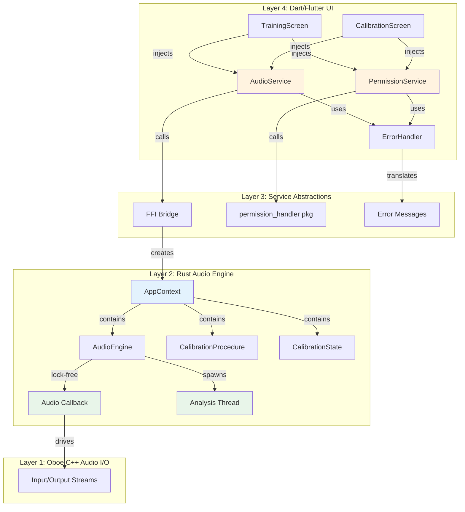

# Design Document: Code Quality Refactoring

## Overview

This design establishes a testable, maintainable architecture for the Beatbox Trainer codebase while preserving the real-time audio performance guarantees that are core to the product. The refactoring introduces dependency injection, custom error handling, service abstractions, and modular component design to eliminate the critical issues identified in the code audit (5 global statics, 11+ unwrap() calls, ~150 lines duplication, 0% Dart test coverage).

**Key Principle**: Refactor non-audio-path code for testability while maintaining zero-allocation, lock-free guarantees in the audio callback.

## Steering Document Alignment

### Technical Standards (tech.md)

**Real-Time Safety Guarantees** (tech.md:64-69):
- ✅ Audio callback remains allocation-free and lock-free
- ✅ Atomic operations (AtomicU64, AtomicU32) preserved for frame counter and BPM
- ✅ Lock-free buffer pool pattern unchanged
- ✅ Pre-allocated click samples and buffers maintained

**4-Layer Native-First Stack** (tech.md:43-55):
- ✅ Layer 1 (Oboe) unchanged
- ✅ Layer 2 (Rust) refactored for testability with AppContext injection
- ✅ Layer 3 (flutter_rust_bridge) enhanced with custom error types
- ✅ Layer 4 (Dart/Flutter) enhanced with service layer

**Architecture Pattern** (tech.md:57-69):
- ✅ Event-driven, lock-free multi-threaded pipeline preserved
- ✅ AudioThread, AnalysisThread, UI Thread separation maintained
- ✅ MPSC → Broadcast pattern for multi-subscriber streams unchanged

### Project Structure (structure.md)

New directories to add:
```
lib/
├── services/          # NEW: Service layer abstractions
│   ├── audio/
│   ├── permission/
│   └── error_handler/
├── ui/
│   ├── widgets/       # ENHANCED: Shared widgets extracted
│   └── utils/         # NEW: Display formatters
rust/src/
├── error/             # NEW: Custom error types
└── context/           # NEW: Dependency injection
```

## Code Reuse Analysis

### Existing Components to Leverage

**Rust Audio Engine** (PRESERVE):
- **AudioEngine** (`audio/engine.rs:59-76`): Atomic-based state management, builder pattern, lock-free callback
- **BufferPool** (`audio/buffer_pool.rs`): Lock-free SPSC queues with dual-channel pattern
- **Analysis Pipeline** (`analysis/mod.rs`): OnsetDetector → FeatureExtractor → Classifier → Quantizer
- **Calibration State** (`calibration/state.rs`): RwLock-protected threshold storage

**FFI Bridge** (ENHANCE):
- **flutter_rust_bridge** annotations: #[frb(sync)], #[frb], #[frb(stream)]
- **Serializable structs**: ClassificationResult, CalibrationProgress, BeatboxHit
- **Stream pattern**: MPSC → Broadcast forwarding for multi-subscriber support

**Dart Models** (PRESERVE):
- **Value objects**: ClassificationResult, TimingFeedback, CalibrationProgress
- **Display formatters**: `BeatboxHit.displayName`, `TimingFeedback.formattedError`
- **Enum safety**: Proper pattern matching on BeatboxHit, TimingClassification

### Integration Points

**Rust FFI Layer** (`rust/src/api.rs`):
- Replace global statics with AppContext struct
- Add custom error types that map across FFI boundary
- Inject dependencies into FFI functions

**Dart Service Layer** (NEW):
- Wrap FFI calls in service abstractions (AudioService, PermissionService)
- Translate Rust errors to user-friendly messages
- Provide mockable interfaces for testing

**UI Components** (`lib/ui/screens/*.dart`):
- Inject services via constructor
- Use shared widgets for dialogs, loading, styling
- Separate business logic from presentation

## Architecture

### Modular Design Principles

1. **Single File Responsibility**:
   - `error.rs`: All error types and translations
   - `context.rs`: Dependency injection container
   - `audio_service.dart`: Audio engine lifecycle only
   - `permission_service.dart`: Permission handling only

2. **Component Isolation**:
   - Services don't depend on UI (can be tested independently)
   - UI components receive services via constructor
   - Error handlers are standalone utilities

3. **Service Layer Separation**:
   - **Data Access**: Rust FFI bridge (raw API calls)
   - **Business Logic**: Dart services (validation, error translation, state management)
   - **Presentation**: Dart widgets (UI rendering, user interaction)

4. **Utility Modularity**:
   - Display formatters separated from models
   - Error translation separated from error types
   - Shared widget library for common UI patterns

### System Architecture



### Dependency Flow

**Before Refactoring** (Tight Coupling):
```
TrainingScreen → api.dart (global statics) → AudioEngine
     ↓
Raw Rust errors shown to user
```

**After Refactoring** (Loose Coupling):
```
TrainingScreen → IAudioService (interface) → AudioServiceImpl → AppContext → AudioEngine
                      ↓
                ErrorHandler.translateError()
                      ↓
                User-friendly message
```

## Components and Interfaces

### Component 1: Custom Error Types (Rust)
**File**: `rust/src/error.rs` (NEW)

- **Purpose**: Replace `Result<T, String>` with typed error hierarchy, enable pattern matching and error code propagation
- **Interfaces**:
  ```rust
  pub enum AudioError {
      BpmInvalid { value: u32, min: u32, max: u32 },
      AlreadyRunning,
      NotRunning,
      HardwareError(String),
      PermissionDenied,
      StreamOpenFailed { details: String },
      LockPoisoned { component: String },
  }

  pub enum CalibrationError {
      InsufficientSamples { collected: u8, needed: u8 },
      InvalidFeatures { reason: String },
      NotComplete,
      AlreadyInProgress,
  }

  pub trait ErrorCode {
      fn code(&self) -> u32;
      fn message(&self) -> String;
  }
  ```
- **Dependencies**: None
- **Reuses**: Standard library Result, Display trait

**Error Code Mapping**:
```rust
impl ErrorCode for AudioError {
    fn code(&self) -> u32 {
        match self {
            AudioError::BpmInvalid { .. } => 1001,
            AudioError::AlreadyRunning => 1002,
            AudioError::NotRunning => 1003,
            AudioError::HardwareError(_) => 1004,
            AudioError::PermissionDenied => 1005,
            AudioError::StreamOpenFailed { .. } => 1006,
            AudioError::LockPoisoned { .. } => 1007,
        }
    }

    fn message(&self) -> String {
        match self {
            AudioError::BpmInvalid { value, min, max } =>
                format!("BPM {} out of range [{}, {}]", value, min, max),
            AudioError::AlreadyRunning =>
                "Audio engine already running".to_string(),
            // ...
        }
    }
}
```

### Component 2: AppContext (Rust DI Container)
**File**: `rust/src/context.rs` (NEW)

- **Purpose**: Replace global statics with injected context, enable unit testing with mock dependencies
- **Interfaces**:
  ```rust
  pub struct AppContext {
      audio_engine: Arc<Mutex<Option<AudioEngineState>>>,
      calibration_procedure: Arc<Mutex<Option<CalibrationProcedure>>>,
      calibration_state: Arc<RwLock<CalibrationState>>,
      classification_broadcast: Arc<Mutex<Option<broadcast::Sender<ClassificationResult>>>>,
      calibration_broadcast: Arc<Mutex<Option<broadcast::Sender<CalibrationProgress>>>>,
  }

  impl AppContext {
      pub fn new() -> Self { ... }

      pub fn start_audio(&self, bpm: u32) -> Result<(), AudioError> { ... }
      pub fn stop_audio(&self) -> Result<(), AudioError> { ... }
      pub fn set_bpm(&self, bpm: u32) -> Result<(), AudioError> { ... }

      pub async fn classification_stream(&self) -> impl futures::Stream<Item = ClassificationResult> { ... }

      pub fn start_calibration(&self) -> Result<(), CalibrationError> { ... }
      pub fn finish_calibration(&self) -> Result<(), CalibrationError> { ... }
      pub async fn calibration_stream(&self) -> impl futures::Stream<Item = CalibrationProgress> { ... }
  }
  ```
- **Dependencies**: AudioEngine, CalibrationProcedure, CalibrationState, tokio channels
- **Reuses**: Existing audio engine, calibration logic, broadcast channel pattern

**FFI Bridge Refactoring** (`rust/src/api.rs`):
```rust
// Global context (replaces 5 separate statics)
static APP_CONTEXT: Lazy<AppContext> = Lazy::new(|| AppContext::new());

#[flutter_rust_bridge::frb]
pub fn start_audio(bpm: u32) -> Result<(), AudioError> {
    APP_CONTEXT.start_audio(bpm)
}

#[flutter_rust_bridge::frb]
pub fn stop_audio() -> Result<(), AudioError> {
    APP_CONTEXT.stop_audio()
}
```

**Testing Support**:
```rust
#[cfg(test)]
impl AppContext {
    pub fn new_test() -> Self {
        // Create isolated context for testing
        Self::new()
    }

    pub fn with_mock_engine(mock: MockAudioEngine) -> Self {
        // Inject mock for unit tests
        // ...
    }
}
```

### Component 3: Safe Lock Handling Utilities
**File**: `rust/src/context.rs` (helper methods)

- **Purpose**: Eliminate unwrap() calls on locks, provide graceful error recovery
- **Interfaces**:
  ```rust
  impl AppContext {
      fn lock_audio_engine(&self) -> Result<MutexGuard<Option<AudioEngineState>>, AudioError> {
          self.audio_engine.lock()
              .map_err(|_| AudioError::LockPoisoned { component: "audio_engine".to_string() })
      }

      fn read_calibration(&self) -> Result<RwLockReadGuard<CalibrationState>, CalibrationError> {
          self.calibration_state.read()
              .map_err(|_| CalibrationError::StatePoisoned)
      }

      fn write_calibration(&self) -> Result<RwLockWriteGuard<CalibrationState>, CalibrationError> {
          self.calibration_state.write()
              .map_err(|_| CalibrationError::StatePoisoned)
      }
  }
  ```
- **Dependencies**: Standard library Mutex/RwLock
- **Reuses**: Custom error types

**Example Usage** (replaces unwrap):
```rust
// Before: PANIC RISK
let guard = AUDIO_ENGINE.lock().unwrap();

// After: GRACEFUL ERROR
let guard = self.lock_audio_engine()?;
```

### Component 4: IAudioService Interface (Dart)
**File**: `lib/services/audio/i_audio_service.dart` (NEW)

- **Purpose**: Abstract FFI bridge for dependency injection and testing
- **Interfaces**:
  ```dart
  abstract class IAudioService {
    Future<void> startAudio({required int bpm});
    Future<void> stopAudio();
    Future<void> setBpm({required int bpm});
    Stream<ClassificationResult> getClassificationStream();

    Future<void> startCalibration();
    Future<void> finishCalibration();
    Stream<CalibrationProgress> getCalibrationStream();
  }
  ```
- **Dependencies**: None (pure interface)
- **Reuses**: Model types (ClassificationResult, CalibrationProgress)

### Component 5: AudioServiceImpl (Dart)
**File**: `lib/services/audio/audio_service_impl.dart` (NEW)

- **Purpose**: Concrete implementation wrapping FFI bridge with error translation
- **Interfaces**:
  ```dart
  class AudioServiceImpl implements IAudioService {
    final ErrorHandler _errorHandler;

    AudioServiceImpl({ErrorHandler? errorHandler})
        : _errorHandler = errorHandler ?? ErrorHandler();

    @override
    Future<void> startAudio({required int bpm}) async {
      try {
        await api.startAudio(bpm: bpm);
      } catch (e) {
        throw AudioServiceException(
          message: _errorHandler.translateAudioError(e.toString()),
          originalError: e.toString(),
        );
      }
    }

    @override
    Stream<ClassificationResult> getClassificationStream() {
      return api.classificationStream();
    }

    // ... other methods
  }
  ```
- **Dependencies**: FFI bridge (`api.dart`), ErrorHandler
- **Reuses**: Existing FFI functions, stream pattern

### Component 6: IPermissionService Interface (Dart)
**File**: `lib/services/permission/i_permission_service.dart` (NEW)

- **Purpose**: Abstract permission handling for testability
- **Interfaces**:
  ```dart
  enum PermissionStatus { granted, denied, permanentlyDenied }

  abstract class IPermissionService {
    Future<PermissionStatus> checkMicrophonePermission();
    Future<PermissionStatus> requestMicrophonePermission();
    Future<void> openAppSettings();
  }
  ```
- **Dependencies**: None (pure interface)
- **Reuses**: None

### Component 7: PermissionServiceImpl (Dart)
**File**: `lib/services/permission/permission_service_impl.dart` (NEW)

- **Purpose**: Concrete permission implementation using permission_handler package
- **Interfaces**:
  ```dart
  class PermissionServiceImpl implements IPermissionService {
    @override
    Future<PermissionStatus> checkMicrophonePermission() async {
      final status = await Permission.microphone.status;
      if (status.isGranted) return PermissionStatus.granted;
      if (status.isPermanentlyDenied) return PermissionStatus.permanentlyDenied;
      return PermissionStatus.denied;
    }

    @override
    Future<PermissionStatus> requestMicrophonePermission() async {
      final result = await Permission.microphone.request();
      if (result.isGranted) return PermissionStatus.granted;
      if (result.isPermanentlyDenied) return PermissionStatus.permanentlyDenied;
      return PermissionStatus.denied;
    }

    @override
    Future<void> openAppSettings() async {
      await openAppSettings();
    }
  }
  ```
- **Dependencies**: `permission_handler` package
- **Reuses**: Existing permission_handler integration

### Component 8: ErrorHandler (Dart)
**File**: `lib/services/error_handler/error_handler.dart` (NEW)

- **Purpose**: Translate technical Rust errors to user-friendly messages
- **Interfaces**:
  ```dart
  class ErrorHandler {
    String translateAudioError(String rustError) {
      // Pattern match on Rust error messages
      if (rustError.contains('BPM') && rustError.contains('out of range')) {
        return 'Please choose a tempo between 40 and 240 BPM';
      }
      if (rustError.contains('already running')) {
        return 'Audio is already active. Please stop it first.';
      }
      if (rustError.contains('AudioError::PermissionDenied')) {
        return 'Microphone access required. Please enable in settings.';
      }
      if (rustError.contains('AudioError::StreamOpenFailed')) {
        return 'Unable to access audio hardware. Please check if another app is using the microphone.';
      }
      if (rustError.contains('LockPoisoned')) {
        return 'Internal error occurred. Please restart the app.';
      }

      // Fallback: sanitized generic message
      return 'Audio engine error occurred. Please try restarting.';
    }

    String translateCalibrationError(String rustError) {
      if (rustError.contains('InsufficientSamples')) {
        return 'Not enough samples collected. Please continue making sounds.';
      }
      if (rustError.contains('InvalidFeatures')) {
        return 'Sound quality too low. Please speak louder or move closer to the microphone.';
      }
      if (rustError.contains('NotComplete')) {
        return 'Calibration not finished. Please complete all steps.';
      }

      return 'Calibration error occurred. Please try again.';
    }
  }
  ```
- **Dependencies**: None
- **Reuses**: None

### Component 9: Shared UI Widgets
**Files**: `lib/ui/widgets/*.dart` (NEW)

#### ErrorDialog Widget
```dart
// lib/ui/widgets/error_dialog.dart
class ErrorDialog extends StatelessWidget {
  final String title;
  final String message;
  final VoidCallback? onRetry;

  const ErrorDialog({
    required this.message,
    this.title = 'Error',
    this.onRetry,
    super.key,
  });

  static Future<void> show(BuildContext context, String message, {VoidCallback? onRetry}) {
    return showDialog(
      context: context,
      builder: (context) => ErrorDialog(message: message, onRetry: onRetry),
    );
  }

  @override
  Widget build(BuildContext context) {
    return AlertDialog(
      title: Text(title),
      content: Text(message),
      actions: [
        if (onRetry != null)
          TextButton(
            onPressed: () {
              Navigator.of(context).pop();
              onRetry!();
            },
            child: const Text('Retry'),
          ),
        TextButton(
          onPressed: () => Navigator.of(context).pop(),
          child: const Text('OK'),
        ),
      ],
    );
  }
}
```

#### LoadingOverlay Widget
```dart
// lib/ui/widgets/loading_overlay.dart
class LoadingOverlay extends StatelessWidget {
  final String? message;

  const LoadingOverlay({this.message, super.key});

  @override
  Widget build(BuildContext context) {
    return Center(
      child: Column(
        mainAxisAlignment: MainAxisAlignment.center,
        children: [
          const CircularProgressIndicator(),
          if (message != null) ...[
            const SizedBox(height: 16),
            Text(message!, style: const TextStyle(fontSize: 16)),
          ],
        ],
      ),
    );
  }
}
```

#### StatusCard Widget
```dart
// lib/ui/widgets/status_card.dart
class StatusCard extends StatelessWidget {
  final Color backgroundColor;
  final Color borderColor;
  final IconData icon;
  final String title;
  final String? subtitle;

  const StatusCard({
    required this.backgroundColor,
    required this.borderColor,
    required this.icon,
    required this.title,
    this.subtitle,
    super.key,
  });

  @override
  Widget build(BuildContext context) {
    return Container(
      padding: const EdgeInsets.all(16),
      decoration: BoxDecoration(
        color: backgroundColor.withValues(alpha: 0.1),
        borderRadius: BorderRadius.circular(12),
        border: Border.all(color: borderColor, width: 2),
      ),
      child: Column(
        children: [
          Icon(icon, color: borderColor, size: 32),
          const SizedBox(height: 8),
          Text(
            title,
            style: TextStyle(
              fontSize: 18,
              fontWeight: FontWeight.bold,
              color: borderColor,
            ),
          ),
          if (subtitle != null) ...[
            const SizedBox(height: 4),
            Text(subtitle!, style: const TextStyle(fontSize: 14)),
          ],
        ],
      ),
    );
  }
}
```

### Component 10: Refactored TrainingScreen
**File**: `lib/ui/screens/training_screen.dart` (MODIFIED)

- **Purpose**: Inject services, use shared widgets, separate concerns
- **Interfaces**: Same as current (StatefulWidget)
- **Dependencies**: IAudioService, IPermissionService, ErrorHandler, shared widgets
- **Reuses**: Existing UI layout structure, model types

**Constructor Injection Pattern**:
```dart
class TrainingScreen extends StatefulWidget {
  final IAudioService audioService;
  final IPermissionService permissionService;
  final ErrorHandler errorHandler;

  const TrainingScreen({
    IAudioService? audioService,
    IPermissionService? permissionService,
    ErrorHandler? errorHandler,
    super.key,
  }) : audioService = audioService ?? AudioServiceImpl(),
       permissionService = permissionService ?? PermissionServiceImpl(),
       errorHandler = errorHandler ?? ErrorHandler();

  @override
  State<TrainingScreen> createState() => _TrainingScreenState();
}
```

**Simplified Error Handling**:
```dart
Future<void> _startTraining() async {
  final status = await widget.permissionService.requestMicrophonePermission();

  if (status != PermissionStatus.granted) {
    if (status == PermissionStatus.permanentlyDenied) {
      await _showPermissionDeniedDialog();
    }
    return;
  }

  try {
    await widget.audioService.startAudio(bpm: _currentBpm);
    final stream = widget.audioService.getClassificationStream();

    setState(() {
      _isTraining = true;
      _classificationStream = stream;
    });
  } on AudioServiceException catch (e) {
    if (mounted) {
      await ErrorDialog.show(context, e.message, onRetry: _startTraining);
    }
  }
}
```

### Component 11: File/Function Size Refactorings

#### Split calibration/procedure.rs (581 lines → 3 files)
```
rust/src/calibration/
├── procedure.rs (200 lines) - Main CalibrationProcedure struct
├── validation.rs (150 lines) - Sample validation logic
└── progress.rs (150 lines) - Progress tracking and reporting
```

**Module Organization**:
```rust
// calibration/mod.rs
pub mod procedure;
pub mod validation;
pub mod progress;
pub mod state;

pub use procedure::CalibrationProcedure;
pub use validation::SampleValidator;
pub use progress::{CalibrationProgress, CalibrationSound};
pub use state::CalibrationState;
```

#### Split analysis/features.rs (576 lines → 5 files)
```
rust/src/analysis/features/
├── mod.rs (100 lines) - FeatureExtractor coordinator
├── spectral.rs (150 lines) - Centroid, rolloff, flatness
├── temporal.rs (120 lines) - ZCR, decay time
├── fft.rs (100 lines) - FFT computation
└── types.rs (100 lines) - Features struct, builder
```

#### Break down AudioEngine::start() (112 lines → 4 functions)
```rust
impl AudioEngine {
    pub fn start(
        &mut self,
        calibration: Arc<RwLock<CalibrationState>>,
        result_sender: mpsc::UnboundedSender<ClassificationResult>,
    ) -> Result<(), String> {
        // Orchestration only (25 lines)
        let input_stream = self.create_input_stream()?;
        let output_stream = self.create_output_stream()?;

        input_stream.start()?;
        output_stream.start()?;

        self.spawn_analysis_thread(calibration, result_sender);

        self.input_stream = Some(input_stream);
        self.output_stream = Some(output_stream);

        Ok(())
    }

    fn create_input_stream(&self) -> Result<AudioStreamAsync<Input>, String> {
        // 20 lines
    }

    fn create_output_stream(&self) -> Result<AudioStreamAsync<Output>, String> {
        // 40 lines (callback closure)
    }

    fn spawn_analysis_thread(
        &self,
        calibration: Arc<RwLock<CalibrationState>>,
        result_sender: mpsc::UnboundedSender<ClassificationResult>,
    ) {
        // 25 lines
    }
}
```

#### Break down _buildProgressContent (169 lines → 3 methods)
```dart
Widget _buildProgressContent(CalibrationProgress progress) {
  return Column(
    children: [
      _buildOverallProgressHeader(progress),
      _buildCurrentSoundInstructions(progress),
      _buildProgressIndicator(progress),
      _buildStatusMessage(progress),
    ],
  );
}

Widget _buildOverallProgressHeader(CalibrationProgress progress) {
  // 30 lines - Step indicator + progress bar
}

Widget _buildCurrentSoundInstructions(CalibrationProgress progress) {
  // 50 lines - Icon + instruction + description
}

Widget _buildProgressIndicator(CalibrationProgress progress) {
  // 30 lines - Counter + progress bar
}

Widget _buildStatusMessage(CalibrationProgress progress) {
  // 50 lines - StatusCard for completion/transition
}
```

## Data Models

### Error Models (Rust)

```rust
// rust/src/error.rs

#[derive(Debug, Clone)]
pub enum AudioError {
    BpmInvalid { value: u32, min: u32, max: u32 },
    AlreadyRunning,
    NotRunning,
    HardwareError(String),
    PermissionDenied,
    StreamOpenFailed { details: String },
    LockPoisoned { component: String },
}

#[derive(Debug, Clone)]
pub enum CalibrationError {
    InsufficientSamples { collected: u8, needed: u8 },
    InvalidFeatures { reason: String },
    NotComplete,
    AlreadyInProgress,
    StatePoisoned,
}

// Error code mapping for FFI
pub trait ErrorCode {
    fn code(&self) -> u32;
    fn message(&self) -> String;
}
```

### Service Exception Models (Dart)

```dart
// lib/services/exceptions.dart

class AudioServiceException implements Exception {
  final String message;
  final String originalError;
  final int? errorCode;

  const AudioServiceException({
    required this.message,
    required this.originalError,
    this.errorCode,
  });

  @override
  String toString() => message;
}

class CalibrationServiceException implements Exception {
  final String message;
  final String originalError;

  const CalibrationServiceException({
    required this.message,
    required this.originalError,
  });

  @override
  String toString() => message;
}
```

### Existing Models (NO CHANGES)

- **ClassificationResult**: Preserved as-is
- **TimingFeedback**: Preserved as-is
- **CalibrationProgress**: Preserved as-is
- **BeatboxHit enum**: Preserved as-is

## Error Handling

### Error Scenarios

#### 1. BPM Validation Failure
- **Scenario**: User sets BPM outside valid range (40-240)
- **Rust Handling**:
  ```rust
  if bpm < 40 || bpm > 240 {
      return Err(AudioError::BpmInvalid { value: bpm, min: 40, max: 240 });
  }
  ```
- **Dart Translation**: "Please choose a tempo between 40 and 240 BPM"
- **User Impact**: Error dialog with retry button, BPM slider resets to valid value

#### 2. Audio Engine Already Running
- **Scenario**: User clicks Start while audio is active
- **Rust Handling**:
  ```rust
  let guard = self.lock_audio_engine()?;
  if guard.is_some() {
      return Err(AudioError::AlreadyRunning);
  }
  ```
- **Dart Translation**: "Audio is already active. Please stop it first."
- **User Impact**: Error dialog, Start button remains disabled

#### 3. Hardware Access Failure
- **Scenario**: Another app is using microphone (e.g., phone call)
- **Rust Handling**:
  ```rust
  let input_stream = self.create_input_stream()
      .map_err(|e| AudioError::StreamOpenFailed { details: e.to_string() })?;
  ```
- **Dart Translation**: "Unable to access audio hardware. Please check if another app is using the microphone."
- **User Impact**: Error dialog with retry button

#### 4. Lock Poisoned (Panic Recovery)
- **Scenario**: Thread panicked while holding lock
- **Rust Handling**:
  ```rust
  fn lock_audio_engine(&self) -> Result<MutexGuard<_>, AudioError> {
      self.audio_engine.lock()
          .map_err(|_| AudioError::LockPoisoned { component: "audio_engine".to_string() })
  }
  ```
- **Dart Translation**: "Internal error occurred. Please restart the app."
- **User Impact**: Error dialog, app restart recommended

#### 5. Permission Permanently Denied
- **Scenario**: User denied microphone permission multiple times
- **Dart Handling**:
  ```dart
  final status = await permissionService.requestMicrophonePermission();
  if (status == PermissionStatus.permanentlyDenied) {
      await showPermissionSettingsDialog();
  }
  ```
- **User Impact**: Dialog with "Open Settings" button

#### 6. Calibration Incomplete
- **Scenario**: User tries to finish calibration with < 10 samples
- **Rust Handling**:
  ```rust
  if !self.is_complete() {
      return Err(CalibrationError::NotComplete);
  }
  ```
- **Dart Translation**: "Calibration not finished. Please complete all steps."
- **User Impact**: Error dialog, stays on calibration screen

### Error Propagation Chain

```
Rust Error → Result<T, AudioError>
    ↓
FFI Bridge → Dart Exception
    ↓
ErrorHandler.translate() → User-friendly String
    ↓
ErrorDialog.show() → UI Display
```

## Testing Strategy

### Unit Testing

#### Rust Tests
**Target Coverage**: 90% for error handling, AppContext, lock management

```rust
// rust/src/context.rs
#[cfg(test)]
mod tests {
    use super::*;

    #[test]
    fn test_appcontext_start_audio_validates_bpm() {
        let ctx = AppContext::new_test();

        let result = ctx.start_audio(0);
        assert!(matches!(result, Err(AudioError::BpmInvalid { value: 0, .. })));

        let result = ctx.start_audio(300);
        assert!(matches!(result, Err(AudioError::BpmInvalid { value: 300, .. })));
    }

    #[test]
    fn test_appcontext_prevents_double_start() {
        let ctx = AppContext::new_test();

        ctx.start_audio(120).unwrap();
        let result = ctx.start_audio(120);

        assert!(matches!(result, Err(AudioError::AlreadyRunning)));
    }

    #[test]
    fn test_lock_poisoning_recovery() {
        let ctx = AppContext::new_test();

        // Simulate poisoned lock (requires unsafe or panic injection)
        // ...

        let result = ctx.lock_audio_engine();
        assert!(matches!(result, Err(AudioError::LockPoisoned { .. })));
    }
}
```

#### Dart Service Tests
**Target Coverage**: 80% for service layer, error translation

```dart
// test/services/audio_service_test.dart
import 'package:flutter_test/flutter_test.dart';
import 'package:mocktail/mocktail.dart';

class MockFFIBridge extends Mock implements FFIBridge {}
class MockErrorHandler extends Mock implements ErrorHandler {}

void main() {
  late MockFFIBridge mockBridge;
  late MockErrorHandler mockErrorHandler;
  late AudioServiceImpl service;

  setUp(() {
    mockBridge = MockFFIBridge();
    mockErrorHandler = MockErrorHandler();
    service = AudioServiceImpl(
      bridge: mockBridge,
      errorHandler: mockErrorHandler,
    );
  });

  test('startAudio throws AudioServiceException on invalid BPM', () async {
    when(() => mockBridge.startAudio(bpm: 0))
        .thenThrow(Exception('AudioError::BpmInvalid'));
    when(() => mockErrorHandler.translateAudioError(any()))
        .thenReturn('Please choose a tempo between 40 and 240 BPM');

    expect(
      () => service.startAudio(bpm: 0),
      throwsA(isA<AudioServiceException>()),
    );
  });

  test('getClassificationStream returns stream from bridge', () {
    final mockStream = Stream<ClassificationResult>.empty();
    when(() => mockBridge.classificationStream()).thenAnswer((_) => mockStream);

    final stream = service.getClassificationStream();

    expect(stream, equals(mockStream));
  });
}
```

### Integration Testing

#### Rust Integration Tests
**Target**: Full lifecycle (start → classify → stop)

```rust
// rust/tests/integration_test.rs
#[tokio::test]
async fn test_full_audio_lifecycle() {
    let ctx = AppContext::new();

    // Start audio engine
    ctx.start_audio(120).unwrap();

    // Subscribe to classification stream
    let mut stream = ctx.classification_stream().await;

    // Simulate audio input (inject test samples)
    // ...

    // Verify classification results arrive
    tokio::time::timeout(Duration::from_secs(5), async {
        let result = stream.next().await;
        assert!(result.is_some());
    }).await.unwrap();

    // Stop audio engine
    ctx.stop_audio().unwrap();

    // Verify stream closed
    let result = stream.next().await;
    assert!(result.is_none());
}
```

#### Dart Widget Tests
**Target**: Screen behavior with mocked services

```dart
// test/ui/screens/training_screen_test.dart
import 'package:flutter_test/flutter_test.dart';

void main() {
  late MockAudioService mockAudioService;
  late MockPermissionService mockPermissionService;

  setUp(() {
    mockAudioService = MockAudioService();
    mockPermissionService = MockPermissionService();
  });

  testWidgets('shows error dialog on audio start failure', (tester) async {
    when(() => mockPermissionService.requestMicrophonePermission())
        .thenAnswer((_) async => PermissionStatus.granted);
    when(() => mockAudioService.startAudio(bpm: any(named: 'bpm')))
        .thenThrow(AudioServiceException(
          message: 'Audio hardware unavailable',
          originalError: 'StreamOpenFailed',
        ));

    await tester.pumpWidget(MaterialApp(
      home: TrainingScreen(
        audioService: mockAudioService,
        permissionService: mockPermissionService,
      ),
    ));

    // Tap start button
    await tester.tap(find.byIcon(Icons.play_arrow));
    await tester.pumpAndSettle();

    // Verify error dialog shown
    expect(find.text('Audio hardware unavailable'), findsOneWidget);
    expect(find.text('Retry'), findsOneWidget);
  });
}
```

### End-to-End Testing

#### Manual Test Scenarios
**Target**: Real device validation

1. **Happy Path**:
   - Grant microphone permission
   - Start audio at 120 BPM
   - Make kick/snare/hihat sounds
   - Verify classification accuracy > 90%
   - Stop audio cleanly

2. **Permission Denial**:
   - Deny microphone permission
   - Verify app doesn't crash
   - Verify user-friendly error message
   - Tap "Open Settings"
   - Grant permission
   - Retry successfully

3. **Hardware Conflict**:
   - Start phone call while app is running
   - Verify graceful error handling
   - End call
   - Retry audio engine start
   - Verify recovery

4. **Calibration Flow**:
   - Complete 10 kick samples
   - Complete 10 snare samples
   - Complete 10 hihat samples
   - Verify thresholds computed
   - Start training
   - Verify classification uses calibrated thresholds

## Implementation Notes

### Phase 1: Error Infrastructure (Priority P0)
**Estimated Effort**: 2 days

1. Create `rust/src/error.rs` with custom error types
2. Implement ErrorCode trait
3. Replace all `Result<T, String>` with typed errors
4. Replace all `.unwrap()` with `?` operator or proper handling
5. Add error translation in flutter_rust_bridge annotations

### Phase 2: Dependency Injection (Priority P0)
**Estimated Effort**: 3 days

1. Create `rust/src/context.rs` with AppContext struct
2. Move global statics into AppContext fields
3. Implement lock helper methods
4. Refactor `api.rs` to use single APP_CONTEXT static
5. Add test helpers (new_test, with_mock_engine)

### Phase 3: Dart Service Layer (Priority P1)
**Estimated Effort**: 2 days

1. Create service interfaces (IAudioService, IPermissionService)
2. Implement concrete services (AudioServiceImpl, PermissionServiceImpl)
3. Create ErrorHandler with translation logic
4. Create service exception types
5. Refactor TrainingScreen to use dependency injection
6. Refactor CalibrationScreen to use dependency injection

### Phase 4: Shared UI Components (Priority P1)
**Estimated Effort**: 1 day

1. Extract ErrorDialog widget
2. Extract LoadingOverlay widget
3. Extract StatusCard widget
4. Update screens to use shared widgets
5. Remove duplicated code

### Phase 5: File/Function Size Refactoring (Priority P2)
**Estimated Effort**: 3 days

1. Split `calibration/procedure.rs` into 3 modules
2. Split `analysis/features.rs` into 5 modules
3. Break down `AudioEngine::start()` into helper methods
4. Break down `_buildProgressContent()` into sub-methods
5. Break down `_buildClassificationDisplay()` into sub-methods
6. Update imports and module structure

### Phase 6: Testing Infrastructure (Priority P1)
**Estimated Effort**: 4 days

1. Create pre-commit hook script
2. Add Rust unit tests for AppContext
3. Add Dart unit tests for services
4. Add Dart widget tests for screens
5. Configure coverage reporting
6. Document test execution in README

**Total Estimated Effort**: 15 days

## Success Criteria

- ✅ 0 unwrap/expect calls in production Rust code
- ✅ 0 global state variables (replaced with 1 AppContext)
- ✅ All FFI functions return typed errors (AudioError, CalibrationError)
- ✅ 80% overall test coverage, 90% for critical paths
- ✅ < 50 duplicated lines (currently ~150)
- ✅ 0 functions > 50 lines
- ✅ 0 source files > 500 lines (excluding tests)
- ✅ Audio latency remains < 20ms (no regression)
- ✅ Pre-commit hooks block commits with quality violations
