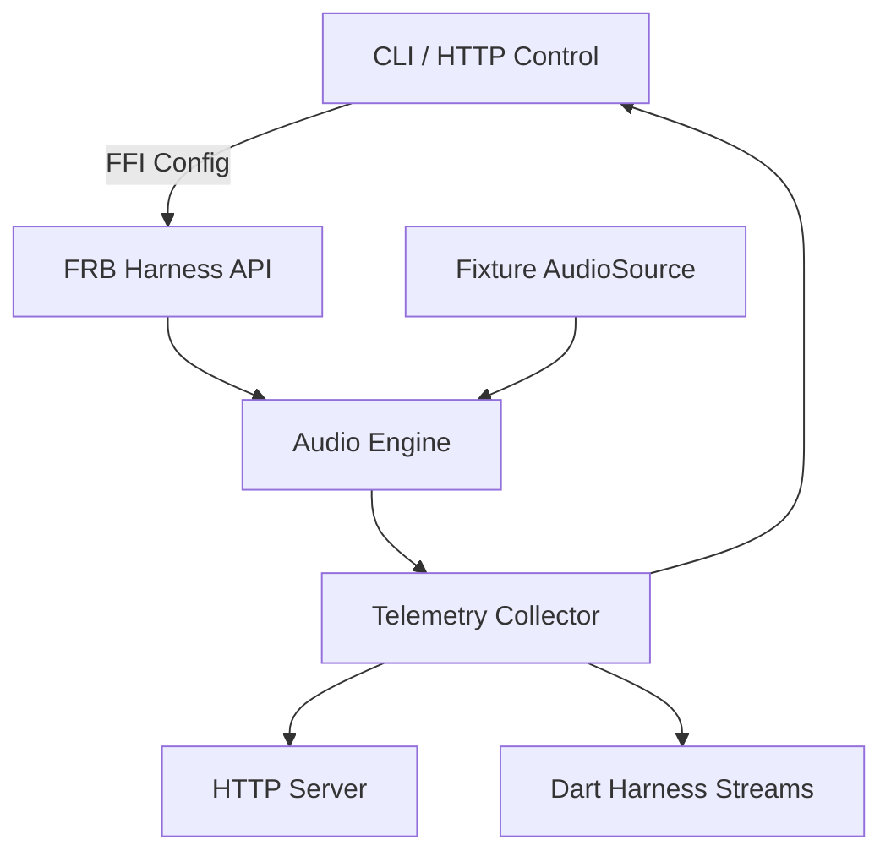

# Design Document

## Overview
Diagnostics-and-testability-platform delivers deterministic harnesses, telemetry plumbing, and debugging surfaces across the native audio stack. The solution adds fixture-driven pipelines that execute C++ Oboe entrypoints, Rust DSP, JNI bridges, and Flutter controllers in headless or automated contexts, complemented by a CLI and HTTP debug server for rapid feedback. Modular adapters abstract audio sources, telemetry sinks, and bridge contracts so developers can swap real hardware input for synthesized buffers or recorded PCM when running on desktop CI nodes.

## Steering Document Alignment

### Technical Standards (tech.md)
- Preserves the 4-layer native-first stack: the CLI/HTTP tooling boots the same Rust audio engine and oboe-rs callbacks through flutter_rust_bridge to ensure parity with production paths.
- Maintains zero-allocation requirements by wrapping instrumentation behind compile-time feature flags and using pre-allocated ring buffers for fixture playback.
- Follows the event-driven, lock-free architecture by extending the existing rtrb channels with multiplexed producers for fixture data and telemetry observers.

### Project Structure (structure.md)
- Places Dart harness utilities under `lib/services/audio/test_harness/` mirroring existing service folders, with tests in `test/services/audio/test_harness/`.
- Adds Rust modules in `rust/src/testing/` for fixture feeders, telemetry, and HTTP server glue, plus integration tests in `rust/tests/` using the new fixtures.
- CLI entrypoints live in `tools/cli/diagnostics/` and reuse Cargo binaries configured in `rust/Cargo.toml`.
- HTTP server assets (OpenAPI, docs) sit in `docs/guides/qa/diagnostics.md` and `docs/api/` per structure guidance.

## Code Reuse Analysis

### Existing Components to Leverage
- **`rust/src/audio/buffer_pool.rs`**: reuse the buffer pool and SPSC queues for fixture playback to avoid new allocation strategies.
- **`rust/src/api.rs` + flutter_rust_bridge bindings**: extend existing APIs with harness hooks (e.g., `start_fixture_session`, `attach_debug_sink`).
- **`lib/services/audio/audio_controller.dart`**: wrap with mockable interfaces so test harnesses drive UI controllers without device hardware.
- **`scripts/coverage.sh`**: integrate new Rust/Dart test suites to maintain coverage automation.

### Integration Points
- **JNI/Flutter bridge**: instrumentation adds mock adapters that implement the same Dart stream contracts while sourcing data from Rust fixture sessions.
- **Docs/QA guides**: update `docs/guides/qa/TESTING.md` with harness usage and CLI recipes.
- **CI scripts**: extend `scripts/pre-commit` to run harness unit/integration suites and optionally the CLI smoke tests.

## Architecture

The platform introduces three capability zones:
1. **Fixture Execution Layer** (Rust + C++ Oboe stubs): pluggable `AudioSource` trait feeds PCM frames from microphone, synthesized patterns, or WAV files. Audio sources push frames into the existing `AudioEngine`, ensuring identical processing paths.
2. **Observability Layer** (Rust telemetry bus + Dart log adapters): instrumentation hooks aggregate latency, buffer occupancy, classification tallies, and JNI lifecycle events, exposing them through structured logs, CLI output, and HTTP endpoints.
3. **Control Surfaces** (CLI, HTTP server, Dart harness): developer-facing entrypoints that trigger fixture sessions, subscribe to telemetry, and drive UI states for integration tests.

### Modular Design Principles
- **Single File Responsibility**: separate `fixture_loader.rs`, `telemetry/metrics.rs`, `cli/main.rs`, `http/server.rs`, `dart test harness adapters`, etc.
- **Component Isolation**: CLI orchestrator only coordinates configuration and delegates to Rust library via FFI; HTTP server uses feature-flagged runtime to avoid impacting production builds.
- **Service Layer Separation**: telemetry aggregator collects metrics, while sinks (CLI, HTTP, Dart) consume read-only streams.
- **Utility Modularity**: common fixture parsing utilities shared between CLI and tests live under `rust/src/testing/fixtures.rs` and `lib/services/audio/test_harness/fixtures.dart` for Dart-level checks.



## Components and Interfaces

### Rust Fixture Engine (`rust/src/testing/fixture_engine.rs`)
- **Purpose:** Feed PCM frames from fixtures/synth sources into `AudioEngine` for deterministic processing.
- **Interfaces:**
  - `FixtureSpec` (struct) describing sample rate, channels, source (mic|wav|synthetic), loop count.
  - `start_fixture_session(spec: FixtureSpec, sinks: TelemetrySinks) -> FixtureHandle`.
  - `FixtureHandle::stop()` to end sessions deterministically.
- **Dependencies:** `audio::engine`, `audio::buffer_pool`, new `testing::fixtures` utilities.
- **Reuses:** Buffer pools, audio engine configuration, flutter_rust_bridge exported methods.

### Telemetry Collector (`rust/src/telemetry/mod.rs`)
- **Purpose:** Aggregate metrics/events from audio engine, classifier, quantizer, JNI lifecycle, and expose them via channels.
- **Interfaces:**
  - `TelemetrySink` trait with `on_metric(MetricEvent)`.
  - `MetricsSnapshot` struct serialized for HTTP/CLI.
  - `subscribe()` returning async stream for Dart bridge.
- **Dependencies:** existing classifier/timing modules for instrumentation hooks, `serde` for serialization.
- **Reuses:** ring buffers for lock-free metric emission.

### Diagnostics CLI (`rust/src/bin/bbt-diag.rs` + `tools/cli/diagnostics/run.sh`)
- **Purpose:** Run fixture sessions from terminal, emit metrics/logs, support loopback and HTTP server bootstrapping.
- **Interfaces:**
  - Flags: `--fixture <path>`, `--synthetic <pattern>`, `--loopback`, `--metrics-port`, `--duration`, `--telemetry-format json|table`.
  - Commands: `run`, `serve`, `record` (capture classification traces to file).
- **Dependencies:** fixture engine, telemetry collector, HTTP server module when `serve` used.
- **Reuses:** new harness APIs via FRB or direct Rust library invocation.

### HTTP Debug Server (`rust/src/debug/http.rs`)
- **Purpose:** Provide `/healthz`, `/metrics`, `/trace` endpoints for developers and tooling.
- **Interfaces:**
  - `start_http_server(config: HttpConfig, telemetry: TelemetryStream) -> ServerHandle`.
  - Endpoints return JSON or Prometheus text; `/trace` streams SSE/WebSocket for live updates.
- **Dependencies:** `axum` or `hyper` optional dependency gated behind `debug-http` feature, telemetry collector.
- **Reuses:** fixture handle for start/stop, metrics aggregator for snapshots.

### Dart Test Harness Package (`lib/services/audio/test_harness/`)
- **Purpose:** Provide adapters so widget/controllers tests can consume fixture streams without device hardware.
- **Interfaces:**
  - `HarnessAudioSource` abstract class with implementations: `MicrophoneProxy`, `FixtureFileSource`, `SyntheticPatternSource`.
  - `DiagnosticsController` orchestrating FRB calls to `start_fixture_session`, plus `Stream<DiagnosticMetric>` for UI tests.
- **Dependencies:** flutter_rust_bridge generated APIs, `lib/services/audio/audio_controller.dart`.
- **Reuses:** existing controllers but inject harness via constructor or provider.

### Android Instrumentation Hooks (`android/app/src/.../DiagnosticsReceiver.kt`)
- **Purpose:** Provide intent receivers/tests that assert JNI lifecycle events and permission handling without manual devices.
- **Interfaces:**
  - `DiagnosticsReceiver` logs `onLoad`, `onUnload`, `onPermissionResult` events to shared storage for instrumentation tests.
  - Espresso/Instrumentation tests read logs via `UiAutomation` to ensure order.
- **Dependencies:** existing MainActivity, JNI loader.

## Data Models

### Rust `FixtureSpec`
```
pub struct FixtureSpec {
    pub id: String,
    pub source: FixtureSource,
    pub sample_rate: u32,
    pub channels: u8,
    pub duration_ms: u32,
    pub loop_count: u16,
    pub metadata: HashMap<String, String>,
}
```

### Rust `MetricEvent`
```
pub enum MetricEvent {
    Latency { avg_ms: f32, max_ms: f32 },
    BufferOccupancy { channel: &'static str, percent: f32 },
    Classification { sound: SoundClass, confidence: f32, delta_ms: f32 },
    JniLifecycle { phase: LifecyclePhase, timestamp: i64 },
    Error { code: DiagnosticError, context: String },
}
```

### Dart `DiagnosticMetric`
```
class DiagnosticMetric {
  DiagnosticMetric({
    required this.type,
    required this.payload,
    required this.timestamp,
  });

  final DiagnosticMetricType type;
  final Map<String, Object?> payload;
  final DateTime timestamp;
}
```

## Error Handling

### Error Scenarios
1. **Fixture Load Failure:** Invalid path/format.
   - **Handling:** `FixtureEngine` returns `DiagnosticError::FixtureLoad`; CLI exits non-zero with message, Dart harness emits error stream event; HTTP `/healthz` reports `status=degraded`.
   - **User Impact:** Developer sees actionable error and remediation hints.

2. **Telemetry Backpressure:** Sink not consuming fast enough.
   - **Handling:** Telemetry collector drops oldest samples with warning, increments `dropped_metrics` counter surfaced in metrics endpoint; CLI warns user to reduce sampling frequency.
   - **User Impact:** Metrics may appear downsampled but audio processing continues unaffected.

3. **JNI Lifecycle Regression:** Missing permission handling or load failure.
   - **Handling:** Instrumentation tests assert callback order; on runtime detection, telemetry emits `DiagnosticError::JniLifecycle` causing CLI/HTTP to warn and fail exit code.
   - **User Impact:** Developers catch regressions before shipping.

## Testing Strategy

### Unit Testing
- Rust: `fixture_engine`, `telemetry`, `http` modules with pure unit tests validating buffer sizes, serialization, CLI argument parsing.
- Dart: `DiagnosticsController`, harness adapters, telemetry stream parsing.
- Kotlin: `DiagnosticsReceiver` instrumentation tests (Robolectric/Instrumentation) verifying intents/logs.

### Integration Testing
- Add `rust/tests/fixture_end_to_end.rs` running fixture data through audio engine and asserting classification timelines.
- Flutter integration tests in `test/integration/diagnostics/` start fixture sessions via FRB and validate UI state changes and log aggregation.
- CLI smoke tests via `scripts/pre-commit` to execute `cargo run --bin bbt-diag -- run --synthetic kick-snare` and assert exit code 0 plus metric output regex.

### End-to-End Testing
- Host-driven test script (`scripts/diagnostics_e2e.sh`) launching HTTP server, issuing `/metrics` requests, verifying JSON schema, then running Flutter harness to consume SSE stream.
- Document manual verification for audio loopback with actual hardware while capturing CLI metrics for parity checks.
