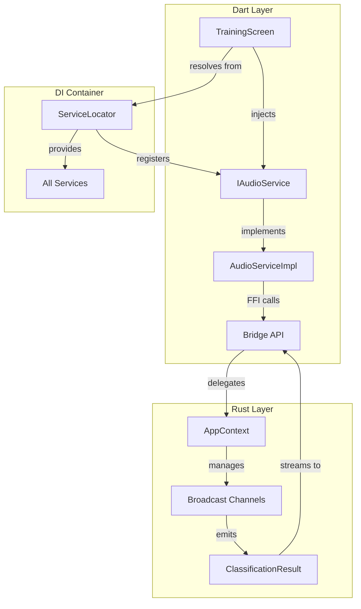
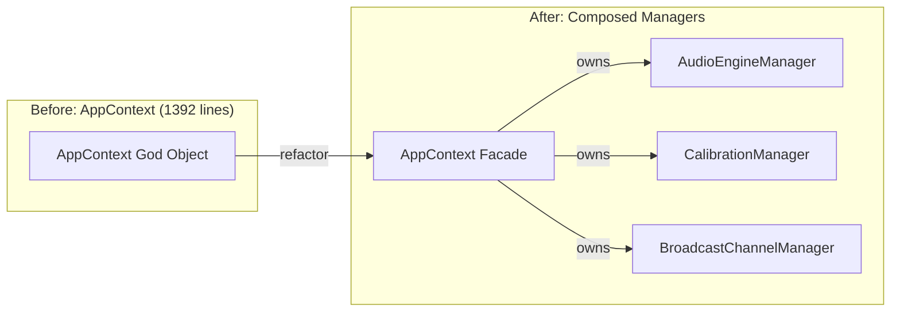

# Design Document: UAT Readiness - Code Quality Remediation

## Overview

This design document provides comprehensive technical solutions for the 12 requirements addressing Critical and High priority code quality issues identified in the audit report. The remediation establishes testability, enforces SOLID principles, and reduces code complexity to meet production readiness standards.

The design follows a phased approach:
- **Week 1 (Critical Fixes)**: Unblock core functionality with stream implementations, establish dependency injection, and enable widget testability
- **Weeks 2-3 (High Priority Refactoring)**: Split god objects, extract business logic, consolidate error handling, and refactor large functions

All architectural changes maintain the existing 4-layer stack (Dart UI → Bridge → Rust Engine → C++ Oboe) with zero performance regression.

## Steering Document Alignment

### Technical Standards (tech.md)

This design adheres to the documented technical patterns:

1. **4-Layer Architecture**: All changes preserve the clean separation between Dart UI, FFI Bridge, Rust Engine, and C++ Oboe layers
2. **Lock-Free Audio Path**: Rust refactoring maintains existing atomics/lock-free patterns in audio callbacks
3. **Interface-Based Design**: All services continue using abstract interfaces (IAudioService, IPermissionService, etc.)
4. **Real-Time Constraints**: Stream implementations add < 5ms overhead while maintaining < 20ms latency and 0 jitter metronome

### Project Structure (structure.md)

The design follows existing project organization conventions:

```
lib/
├── services/              # Service layer (existing pattern)
│   ├── audio/            # IAudioService interface + implementation
│   ├── permission/       # IPermissionService interface + implementation
│   ├── settings/         # ISettingsService interface + implementation
│   ├── storage/          # IStorageService interface + implementation
│   ├── debug/            # IDebugService → split into focused interfaces
│   └── navigation/       # NEW: INavigationService abstraction
├── controllers/          # NEW: Business logic controllers
│   └── training/         # TrainingController extracted from TrainingScreen
├── di/                   # NEW: Dependency injection setup
│   └── service_locator.dart
└── ui/
    └── screens/          # Screens receive injected dependencies

rust/src/
├── context.rs            # Refactored: splits into managers
├── managers/             # NEW: Focused manager classes
│   ├── audio_engine_manager.rs
│   ├── calibration_manager.rs
│   └── broadcast_manager.rs
└── error.rs              # Enhanced: expose error codes to Dart
```

## Code Reuse Analysis

### Existing Components to Leverage

1. **Service Interfaces**: Reuse existing `IAudioService`, `IPermissionService`, `ISettingsService`, `IStorageService` without modification
2. **FFI Bridge**: Leverage existing `flutter_rust_bridge` infrastructure - add stream methods only
3. **Error Handling**: Extend existing `AudioError` and `CalibrationError` enums with FFI-exposed constants
4. **Models**: Reuse `ClassificationResult`, `CalibrationProgress`, `CalibrationData` models unchanged
5. **Rust Thread Safety Patterns**: Continue using `Arc<Mutex<T>>`, `Arc<RwLock<T>>`, and atomics as established

### Integration Points

1. **Existing DI Pattern**: Screens already accept optional dependencies - transition to required injection
2. **Existing Stream Types**: `Stream<ClassificationResult>` and `Stream<CalibrationProgress>` already defined in interface
3. **Existing Broadcast Channels**: AppContext already has tokio broadcast infrastructure - refactor plumbing only
4. **Existing Test Infrastructure**: 48 test files already in place - augment with widget tests after DI fix

## Architecture

### Phase 1: Critical Fixes (Week 1)

Phase 1 removes testability blockers and implements missing core functionality:



**Key Design Decisions**:
1. **GetIt for DI**: Industry-standard service locator with lazy/singleton support
2. **Factory Constructors**: Production code uses `.create()` factory, tests use direct injection
3. **Tokio Streams**: Use `StreamController` in Dart + `tokio::sync::broadcast` in Rust
4. **Error Propagation**: Stream errors emit error states rather than throwing exceptions

### Phase 2: High Priority Refactoring (Weeks 2-3)

Phase 2 addresses SOLID violations through extraction and separation:



**Key Design Decisions**:
1. **Manager Composition**: AppContext becomes a thin facade owning three focused managers
2. **Controller Extraction**: TrainingController handles business logic, screen handles UI only
3. **Error Code Constants**: Generate Dart constants from Rust using code generation
4. **Navigation Abstraction**: INavigationService wraps go_router for testability

## Components and Interfaces

### Requirement 1: Implement Missing Stream Methods

#### Component: StreamController-based Classification Stream

**Purpose**: Deliver real-time classification results from Rust audio engine to Dart UI

**Design**:

```dart
// lib/services/audio/audio_service_impl.dart

class AudioServiceImpl implements IAudioService {
  StreamController<ClassificationResult>? _classificationController;
  StreamSubscription<ClassificationResult>? _classificationSubscription;

  @override
  Stream<ClassificationResult> getClassificationStream() {
    // Lazy initialization: create controller on first access
    _classificationController ??= StreamController<ClassificationResult>.broadcast(
      onCancel: _handleClassificationStreamCancel,
    );

    // Subscribe to FFI stream if not already subscribed
    if (_classificationSubscription == null) {
      _classificationSubscription = api
          .classificationStream()  // NEW FFI method
          .listen(
            (result) => _classificationController!.add(result),
            onError: (error) => _classificationController!.addError(
              AudioServiceException('Classification stream error: $error'),
            ),
          );
    }

    return _classificationController!.stream;
  }

  void _handleClassificationStreamCancel() {
    _classificationSubscription?.cancel();
    _classificationSubscription = null;
    _classificationController?.close();
    _classificationController = null;
  }
}
```

**Rust Bridge Implementation**:

```rust
// rust/src/api.rs

#[flutter_rust_bridge::frb(dart_async)]
pub fn classification_stream(
    context: Arc<AppContext>,
) -> impl Stream<Item = ClassificationResult> {
    let receiver = context.subscribe_classification();
    UnboundedReceiverStream::new(receiver)
}

// rust/src/context.rs

impl AppContext {
    /// Subscribe to classification result broadcast channel
    pub fn subscribe_classification(&self) -> mpsc::UnboundedReceiver<ClassificationResult> {
        let (tx, rx) = mpsc::unbounded_channel();

        let broadcast_tx = self.classification_broadcast
            .lock()
            .unwrap()
            .clone()
            .expect("Classification broadcast not initialized");

        let mut broadcast_rx = broadcast_tx.subscribe();

        // Forward broadcast → mpsc for Flutter consumption
        tokio::spawn(async move {
            while let Ok(result) = broadcast_rx.recv().await {
                if tx.send(result).is_err() {
                    break;  // Receiver dropped
                }
            }
        });

        rx
    }
}
```

**Dependencies**: `flutter_rust_bridge`, `tokio`, `tokio-stream`

**Performance**: < 2ms overhead per result (channel forwarding only)

---

#### Component: StreamController-based Calibration Stream

**Purpose**: Deliver calibration progress updates from Rust to Dart UI

**Design**: Identical pattern to classification stream but for `CalibrationProgress` type

```dart
// lib/services/audio/audio_service_impl.dart

Stream<CalibrationProgress> getCalibrationStream() {
  _calibrationController ??= StreamController<CalibrationProgress>.broadcast(
    onCancel: _handleCalibrationStreamCancel,
  );

  if (_calibrationSubscription == null) {
    _calibrationSubscription = api
        .calibrationStream()  // NEW FFI method
        .listen(
          (progress) => _calibrationController!.add(progress),
          onError: (error) => _calibrationController!.addError(
            CalibrationServiceException('Calibration stream error: $error'),
          ),
        );
  }

  return _calibrationController!.stream;
}
```

**Rust Implementation**: Mirror classification stream pattern with `CalibrationProgress` type

---

### Requirement 2: Establish Dependency Injection Container

#### Component: GetIt Service Locator

**Purpose**: Centralized service registry enabling constructor injection and mock substitution

**Design**:

```dart
// lib/di/service_locator.dart

import 'package:get_it/get_it.dart';
import '../services/audio/i_audio_service.dart';
import '../services/audio/audio_service_impl.dart';
import '../services/permission/i_permission_service.dart';
import '../services/permission/permission_service_impl.dart';
import '../services/settings/i_settings_service.dart';
import '../services/settings/settings_service_impl.dart';
import '../services/storage/i_storage_service.dart';
import '../services/storage/storage_service_impl.dart';
import '../services/debug/i_debug_service.dart';
import '../services/debug/debug_service_impl.dart';
import '../services/navigation/i_navigation_service.dart';
import '../services/navigation/go_router_navigation_service.dart';

/// Global service locator instance
final getIt = GetIt.instance;

/// Initialize all service dependencies
///
/// Must be called before runApp() in main.dart.
/// Registers all services as singletons for consistent state.
Future<void> setupServiceLocator() async {
  // Core services (singletons for state consistency)
  getIt.registerSingleton<IAudioService>(AudioServiceImpl());
  getIt.registerSingleton<IPermissionService>(PermissionServiceImpl());
  getIt.registerSingleton<ISettingsService>(SettingsServiceImpl());
  getIt.registerSingleton<IStorageService>(StorageServiceImpl());
  getIt.registerSingleton<IDebugService>(DebugServiceImpl());

  // Navigation service (singleton)
  getIt.registerSingleton<INavigationService>(GoRouterNavigationService());

  // Initialize async services
  await getIt<ISettingsService>().init();
  await getIt<IStorageService>().init();
  await getIt<IDebugService>().init();
}

/// Reset all services (for testing only)
///
/// Clears GetIt registry and disposes services.
/// Use in test tearDown to ensure clean state.
Future<void> resetServiceLocator() async {
  await getIt<IAudioService>().stopAudio();
  getIt<IDebugService>().dispose();
  await getIt.reset();
}
```

**Updated main.dart**:

```dart
// lib/main.dart

import 'di/service_locator.dart';

Future<void> main() async {
  WidgetsFlutterBinding.ensureInitialized();

  // Setup DI container before app starts
  await setupServiceLocator();

  runApp(const MyApp());
}
```

**Dependencies**: Add `get_it: ^8.0.0` to pubspec.yaml

**Interfaces**: No new interfaces - reuses existing `IAudioService`, etc.

---

### Requirement 3: Remove Service Default Instantiation from Widgets

#### Component: Factory Pattern for Screen Widgets

**Purpose**: Eliminate default service instantiation, enforce constructor injection

**Design**:

```dart
// lib/ui/screens/training_screen.dart (refactored)

class TrainingScreen extends StatefulWidget {
  // Required dependencies (NO defaults)
  final IAudioService audioService;
  final IPermissionService permissionService;
  final ISettingsService settingsService;
  final IDebugService debugService;

  /// Private constructor for dependency injection
  const TrainingScreen._({
    super.key,
    required this.audioService,
    required this.permissionService,
    required this.settingsService,
    required this.debugService,
  });

  /// Factory constructor for production use
  ///
  /// Resolves services from GetIt container.
  factory TrainingScreen.create({Key? key}) {
    return TrainingScreen._(
      key: key,
      audioService: getIt<IAudioService>(),
      permissionService: getIt<IPermissionService>(),
      settingsService: getIt<ISettingsService>(),
      debugService: getIt<IDebugService>(),
    );
  }

  /// Test constructor for dependency injection
  ///
  /// Accepts mock implementations for testing.
  @visibleForTesting
  factory TrainingScreen.test({
    Key? key,
    required IAudioService audioService,
    required IPermissionService permissionService,
    required ISettingsService settingsService,
    required IDebugService debugService,
  }) {
    return TrainingScreen._(
      key: key,
      audioService: audioService,
      permissionService: permissionService,
      settingsService: settingsService,
      debugService: debugService,
    );
  }

  @override
  State<TrainingScreen> createState() => _TrainingScreenState();
}
```

**Router Configuration Update**:

```dart
// lib/main.dart

final GoRouter _router = GoRouter(
  initialLocation: '/',
  routes: [
    GoRoute(path: '/', builder: (context, state) => const SplashScreen()),
    GoRoute(path: '/onboarding', builder: (context, state) => const OnboardingScreen()),
    GoRoute(path: '/calibration', builder: (context, state) => CalibrationScreen.create()),
    GoRoute(path: '/training', builder: (context, state) => TrainingScreen.create()),
    GoRoute(path: '/settings', builder: (context, state) => SettingsScreen.create()),
  ],
);
```

**Test Example**:

```dart
// test/ui/screens/training_screen_test.dart

testWidgets('Training screen displays metronome controls', (tester) async {
  final mockAudio = MockAudioService();
  final mockPermission = MockPermissionService();
  final mockSettings = MockSettingsService();
  final mockDebug = MockDebugService();

  await tester.pumpWidget(
    MaterialApp(
      home: TrainingScreen.test(
        audioService: mockAudio,
        permissionService: mockPermission,
        settingsService: mockSettings,
        debugService: mockDebug,
      ),
    ),
  );

  // Test UI without real service dependencies
  expect(find.text('Start Training'), findsOneWidget);
});
```

**Migration**: Apply same pattern to `CalibrationScreen`, `SettingsScreen`

---

### Requirement 4: Abstract Router for Testability

#### Component: INavigationService Abstraction

**Purpose**: Decouple widgets from go_router for testable navigation

**Design**:

```dart
// lib/services/navigation/i_navigation_service.dart

/// Navigation service interface for testable routing
abstract class INavigationService {
  /// Navigate to specified route
  void goTo(String route);

  /// Navigate back to previous screen
  void goBack();

  /// Replace current route with new route
  void replace(String route);

  /// Check if can go back
  bool canGoBack();
}
```

```dart
// lib/services/navigation/go_router_navigation_service.dart

import 'package:go_router/go_router.dart';
import 'i_navigation_service.dart';

/// GoRouter implementation of INavigationService
class GoRouterNavigationService implements INavigationService {
  final GoRouter _router;

  GoRouterNavigationService(this._router);

  @override
  void goTo(String route) => _router.go(route);

  @override
  void goBack() => _router.pop();

  @override
  void replace(String route) => _router.replace(route);

  @override
  bool canGoBack() => _router.canPop();
}
```

**Updated MyApp**:

```dart
// lib/main.dart

class MyApp extends StatelessWidget {
  final GoRouter? router;

  const MyApp({super.key, this.router});

  @override
  Widget build(BuildContext context) {
    final routerConfig = router ?? _createDefaultRouter();

    // Register navigation service with router instance
    getIt.registerSingleton<INavigationService>(
      GoRouterNavigationService(routerConfig),
    );

    return MaterialApp.router(
      title: 'Beatbox Trainer',
      theme: ThemeData(
        colorScheme: ColorScheme.fromSeed(seedColor: Colors.deepPurple),
        useMaterial3: true,
      ),
      routerConfig: routerConfig,
    );
  }

  static GoRouter _createDefaultRouter() => GoRouter(/* routes */);
}
```

**Widget Usage**:

```dart
// lib/ui/screens/calibration_screen.dart

// Before: Direct go_router dependency
context.go('/training');

// After: Navigation service abstraction
final nav = getIt<INavigationService>();
nav.goTo('/training');
```

**Test Mock**:

```dart
// test/mocks/mock_navigation_service.dart

class MockNavigationService implements INavigationService {
  final List<String> navigationHistory = [];

  @override
  void goTo(String route) => navigationHistory.add('go:$route');

  @override
  void goBack() => navigationHistory.add('back');

  @override
  void replace(String route) => navigationHistory.add('replace:$route');

  @override
  bool canGoBack() => navigationHistory.isNotEmpty;
}
```

**Dependencies**: No new dependencies (abstracts existing go_router)

---

### Requirement 5: Refactor AppContext God Object

#### Component: Split into Three Focused Managers

**Purpose**: Apply Single Responsibility Principle by extracting distinct concerns

**Architecture**:

```
Before:                          After:
┌─────────────────────┐         ┌──────────────────┐
│   AppContext        │         │  AppContext      │
│   (1392 lines)      │         │  (facade)        │
│                     │         └────────┬─────────┘
│ - Audio engine      │                  │
│ - Calibration       │         ┌────────┴─────────────────┐
│ - Broadcast channels│         │                          │
│ - State locks       │    ┌────▼──────┐  ┌────▼──────┐  ┌▼───────────┐
│ - Business logic    │    │  Audio    │  │Calibration│  │ Broadcast  │
└─────────────────────┘    │  Engine   │  │ Manager   │  │  Manager   │
                           │  Manager  │  │           │  │            │
                           └───────────┘  └───────────┘  └────────────┘
                            (Audio only)   (Cal only)    (Channels only)
```

**Design**:

```rust
// rust/src/managers/audio_engine_manager.rs

use std::sync::{Arc, Mutex};
use crate::audio::{AudioEngine, BufferPool};
use crate::calibration::CalibrationState;
use crate::error::AudioError;

/// Manages audio engine lifecycle and state
///
/// Single Responsibility: Audio engine start/stop/configuration
pub struct AudioEngineManager {
    engine: Arc<Mutex<Option<AudioEngine>>>,
}

impl AudioEngineManager {
    pub fn new() -> Self {
        Self {
            engine: Arc::new(Mutex::new(None)),
        }
    }

    /// Start audio engine with specified BPM
    ///
    /// Validates BPM, creates engine with buffer pool, starts audio streams.
    /// Simplified from 86-line method to focused orchestration.
    pub fn start(
        &self,
        bpm: u32,
        calibration: Arc<CalibrationState>,
        classification_tx: mpsc::UnboundedSender<ClassificationResult>,
    ) -> Result<(), AudioError> {
        self.validate_bpm(bpm)?;

        let mut guard = self.lock_engine()?;
        self.check_not_running(&guard)?;

        let buffer_pool = self.create_buffer_pool();
        let mut engine = self.create_engine(bpm, buffer_pool, calibration)?;

        engine.start(classification_tx)?;
        *guard = Some(engine);

        Ok(())
    }

    /// Stop audio engine gracefully
    pub fn stop(&self) -> Result<(), AudioError> {
        let mut guard = self.lock_engine()?;

        if let Some(mut engine) = guard.take() {
            engine.stop()?;
        }

        Ok(())
    }

    /// Update BPM dynamically (engine must be running)
    pub fn set_bpm(&self, bpm: u32) -> Result<(), AudioError> {
        self.validate_bpm(bpm)?;

        let guard = self.lock_engine()?;
        let engine = guard.as_ref().ok_or(AudioError::NotRunning)?;

        engine.set_bpm(bpm);
        Ok(())
    }

    // Private helper methods (each < 10 lines)

    fn validate_bpm(&self, bpm: u32) -> Result<(), AudioError> {
        if bpm < 40 || bpm > 240 {
            return Err(AudioError::BpmInvalid { bpm });
        }
        Ok(())
    }

    fn lock_engine(&self) -> Result<std::sync::MutexGuard<'_, Option<AudioEngine>>, AudioError> {
        self.engine.lock().map_err(|_| AudioError::LockPoisoned {
            component: "audio_engine".to_string(),
        })
    }

    fn check_not_running(&self, guard: &Option<AudioEngine>) -> Result<(), AudioError> {
        if guard.is_some() {
            return Err(AudioError::AlreadyRunning);
        }
        Ok(())
    }

    fn create_buffer_pool(&self) -> BufferPool {
        BufferPool::new(16, 2048)
    }

    fn create_engine(
        &self,
        bpm: u32,
        buffer_pool: BufferPool,
        calibration: Arc<CalibrationState>,
    ) -> Result<AudioEngine, AudioError> {
        AudioEngine::new(bpm, buffer_pool, calibration)
    }
}
```

```rust
// rust/src/managers/calibration_manager.rs

use std::sync::{Arc, Mutex, RwLock};
use crate::calibration::{CalibrationProcedure, CalibrationState};
use crate::error::CalibrationError;

/// Manages calibration workflow and state persistence
///
/// Single Responsibility: Calibration lifecycle and state management
pub struct CalibrationManager {
    procedure: Arc<Mutex<Option<CalibrationProcedure>>>,
    state: Arc<RwLock<CalibrationState>>,
}

impl CalibrationManager {
    pub fn new() -> Self {
        Self {
            procedure: Arc::new(Mutex::new(None)),
            state: Arc::new(RwLock::new(CalibrationState::new_default())),
        }
    }

    /// Start calibration workflow
    pub fn start(&self) -> Result<(), CalibrationError> {
        let mut guard = self.lock_procedure()?;
        self.check_not_in_progress(&guard)?;

        *guard = Some(CalibrationProcedure::new());
        Ok(())
    }

    /// Finish calibration and compute thresholds
    pub fn finish(&self) -> Result<(), CalibrationError> {
        let mut proc_guard = self.lock_procedure()?;
        let procedure = proc_guard.take().ok_or(CalibrationError::NotInProgress)?;

        let calibration_data = procedure.finish()?;

        let mut state_guard = self.lock_state()?;
        *state_guard = calibration_data;

        Ok(())
    }

    /// Get current calibration state (for audio engine)
    pub fn get_state(&self) -> Arc<RwLock<CalibrationState>> {
        Arc::clone(&self.state)
    }

    /// Load calibration state from persistence
    pub fn load_state(&self, state: CalibrationState) -> Result<(), CalibrationError> {
        let mut guard = self.lock_state()?;
        *guard = state;
        Ok(())
    }

    // Private helpers

    fn lock_procedure(&self) -> Result<std::sync::MutexGuard<'_, Option<CalibrationProcedure>>, CalibrationError> {
        self.procedure.lock().map_err(|_| CalibrationError::StatePoisoned)
    }

    fn lock_state(&self) -> Result<std::sync::RwLockWriteGuard<'_, CalibrationState>, CalibrationError> {
        self.state.write().map_err(|_| CalibrationError::StatePoisoned)
    }

    fn check_not_in_progress(&self, guard: &Option<CalibrationProcedure>) -> Result<(), CalibrationError> {
        if guard.is_some() {
            return Err(CalibrationError::AlreadyInProgress);
        }
        Ok(())
    }
}
```

```rust
// rust/src/managers/broadcast_manager.rs

use std::sync::{Arc, Mutex};
use tokio::sync::broadcast;
use crate::analysis::ClassificationResult;
use crate::calibration::CalibrationProgress;
use crate::api::{AudioMetrics, OnsetEvent};

/// Manages all tokio broadcast channels
///
/// Single Responsibility: Broadcast channel lifecycle and subscription
pub struct BroadcastChannelManager {
    classification: Arc<Mutex<Option<broadcast::Sender<ClassificationResult>>>>,
    calibration: Arc<Mutex<Option<broadcast::Sender<CalibrationProgress>>>>,
    audio_metrics: Arc<Mutex<Option<broadcast::Sender<AudioMetrics>>>>,
    onset_events: Arc<Mutex<Option<broadcast::Sender<OnsetEvent>>>>,
}

impl BroadcastChannelManager {
    pub fn new() -> Self {
        Self {
            classification: Arc::new(Mutex::new(None)),
            calibration: Arc::new(Mutex::new(None)),
            audio_metrics: Arc::new(Mutex::new(None)),
            onset_events: Arc::new(Mutex::new(None)),
        }
    }

    /// Initialize classification broadcast channel
    ///
    /// Returns sender for audio engine to publish results
    pub fn init_classification(&self) -> broadcast::Sender<ClassificationResult> {
        let (tx, _) = broadcast::channel(100);
        *self.classification.lock().unwrap() = Some(tx.clone());
        tx
    }

    /// Subscribe to classification results
    pub fn subscribe_classification(&self) -> Option<broadcast::Receiver<ClassificationResult>> {
        self.classification.lock().unwrap().as_ref().map(|tx| tx.subscribe())
    }

    /// Initialize calibration broadcast channel
    pub fn init_calibration(&self) -> broadcast::Sender<CalibrationProgress> {
        let (tx, _) = broadcast::channel(50);
        *self.calibration.lock().unwrap() = Some(tx.clone());
        tx
    }

    /// Subscribe to calibration progress
    pub fn subscribe_calibration(&self) -> Option<broadcast::Receiver<CalibrationProgress>> {
        self.calibration.lock().unwrap().as_ref().map(|tx| tx.subscribe())
    }

    // Similar methods for audio_metrics and onset_events...
}
```

```rust
// rust/src/context.rs (refactored facade)

use crate::managers::{AudioEngineManager, CalibrationManager, BroadcastChannelManager};

/// AppContext: Dependency injection container (refactored facade)
///
/// Delegates to focused managers following Single Responsibility Principle.
/// Reduced from 1392 lines to < 200 lines.
pub struct AppContext {
    audio: AudioEngineManager,
    calibration: CalibrationManager,
    broadcasts: BroadcastChannelManager,
}

impl AppContext {
    pub fn new() -> Self {
        Self {
            audio: AudioEngineManager::new(),
            calibration: CalibrationManager::new(),
            broadcasts: BroadcastChannelManager::new(),
        }
    }

    /// Start audio engine (delegates to AudioEngineManager)
    pub fn start_audio(&self, bpm: u32) -> Result<(), AudioError> {
        let classification_tx = self.broadcasts.init_classification();
        let calibration_state = self.calibration.get_state();

        self.audio.start(bpm, calibration_state, classification_tx)
    }

    /// Stop audio engine (delegates to AudioEngineManager)
    pub fn stop_audio(&self) -> Result<(), AudioError> {
        self.audio.stop()
    }

    /// Set BPM (delegates to AudioEngineManager)
    pub fn set_bpm(&self, bpm: u32) -> Result<(), AudioError> {
        self.audio.set_bpm(bpm)
    }

    /// Start calibration (delegates to CalibrationManager)
    pub fn start_calibration(&self) -> Result<(), CalibrationError> {
        self.calibration.start()
    }

    /// Finish calibration (delegates to CalibrationManager)
    pub fn finish_calibration(&self) -> Result<(), CalibrationError> {
        self.calibration.finish()
    }

    /// Subscribe to classification stream (delegates to BroadcastChannelManager)
    pub fn subscribe_classification(&self) -> Option<broadcast::Receiver<ClassificationResult>> {
        self.broadcasts.subscribe_classification()
    }

    /// Subscribe to calibration stream (delegates to BroadcastChannelManager)
    pub fn subscribe_calibration(&self) -> Option<broadcast::Receiver<CalibrationProgress>> {
        self.broadcasts.subscribe_calibration()
    }
}
```

**File Structure**:

```
rust/src/
├── context.rs                    # Refactored facade (< 200 lines)
├── managers/
│   ├── mod.rs                    # Module exports
│   ├── audio_engine_manager.rs   # Audio lifecycle (< 150 lines)
│   ├── calibration_manager.rs    # Calibration workflow (< 150 lines)
│   └── broadcast_manager.rs      # Channel management (< 100 lines)
```

**Benefits**:
- context.rs reduced from 1392 → ~200 lines
- Each manager < 200 lines with single responsibility
- Methods reduced from 86 lines → < 20 lines each
- Clear separation enables focused unit testing

---

### Requirement 6: Extract Business Logic from TrainingScreen

#### Component: TrainingController

**Purpose**: Separate UI rendering from business logic (audio control, BPM updates, state management)

**Design**:

```dart
// lib/controllers/training/training_controller.dart

import '../../services/audio/i_audio_service.dart';
import '../../services/permission/i_permission_service.dart';
import '../../services/settings/i_settings_service.dart';
import '../../models/classification_result.dart';

/// Training screen business logic controller
///
/// Handles audio lifecycle, BPM updates, permission requests, and state management.
/// Decoupled from UI for independent testing.
class TrainingController {
  final IAudioService _audioService;
  final IPermissionService _permissionService;
  final ISettingsService _settingsService;

  bool _isTraining = false;
  int _currentBpm = 120;

  TrainingController({
    required IAudioService audioService,
    required IPermissionService permissionService,
    required ISettingsService settingsService,
  })  : _audioService = audioService,
        _permissionService = permissionService,
        _settingsService = settingsService;

  /// Current training state
  bool get isTraining => _isTraining;

  /// Current BPM value
  int get currentBpm => _currentBpm;

  /// Classification result stream
  Stream<ClassificationResult> get classificationStream =>
      _audioService.getClassificationStream();

  /// Start training session
  ///
  /// Requests microphone permission if needed, then starts audio engine.
  Future<void> startTraining() async {
    if (_isTraining) {
      throw StateError('Training already in progress');
    }

    // Request permission if not granted
    final hasPermission = await _requestMicrophonePermission();
    if (!hasPermission) {
      throw PermissionException('Microphone permission denied');
    }

    // Load BPM from settings
    _currentBpm = await _settingsService.getBpm();

    // Start audio engine
    await _audioService.startAudio(bpm: _currentBpm);
    _isTraining = true;
  }

  /// Stop training session
  Future<void> stopTraining() async {
    if (!_isTraining) {
      return;  // No-op if not training
    }

    await _audioService.stopAudio();
    _isTraining = false;
  }

  /// Update BPM during training
  ///
  /// Validates BPM range (40-240), updates audio engine, saves to settings.
  Future<void> updateBpm(int newBpm) async {
    if (newBpm < 40 || newBpm > 240) {
      throw ArgumentError('BPM must be between 40 and 240');
    }

    if (_isTraining) {
      await _audioService.setBpm(bpm: newBpm);
    }

    _currentBpm = newBpm;
    await _settingsService.setBpm(newBpm);
  }

  /// Request microphone permission
  ///
  /// Returns true if granted, false if denied.
  Future<bool> _requestMicrophonePermission() async {
    final status = await _permissionService.checkMicrophonePermission();

    if (status == PermissionStatus.granted) {
      return true;
    }

    if (status == PermissionStatus.denied) {
      final newStatus = await _permissionService.requestMicrophonePermission();
      return newStatus == PermissionStatus.granted;
    }

    if (status == PermissionStatus.permanentlyDenied) {
      await _permissionService.openAppSettings();
      return false;
    }

    return false;
  }

  /// Dispose resources
  Future<void> dispose() async {
    if (_isTraining) {
      await stopTraining();
    }
  }
}
```

**Updated TrainingScreen (UI only)**:

```dart
// lib/ui/screens/training_screen.dart (refactored)

class TrainingScreen extends StatefulWidget {
  final TrainingController controller;

  const TrainingScreen._({
    super.key,
    required this.controller,
  });

  factory TrainingScreen.create({Key? key}) {
    return TrainingScreen._(
      key: key,
      controller: TrainingController(
        audioService: getIt<IAudioService>(),
        permissionService: getIt<IPermissionService>(),
        settingsService: getIt<ISettingsService>(),
      ),
    );
  }

  @override
  State<TrainingScreen> createState() => _TrainingScreenState();
}

class _TrainingScreenState extends State<TrainingScreen> {
  @override
  void dispose() {
    widget.controller.dispose();
    super.dispose();
  }

  @override
  Widget build(BuildContext context) {
    return Scaffold(
      appBar: AppBar(title: const Text('Training')),
      body: Column(
        children: [
          // BPM control
          _buildBpmSlider(),

          // Start/Stop button
          _buildControlButton(),

          // Classification results stream
          _buildClassificationStream(),
        ],
      ),
    );
  }

  Widget _buildBpmSlider() {
    return Slider(
      value: widget.controller.currentBpm.toDouble(),
      min: 40,
      max: 240,
      onChanged: (value) async {
        await widget.controller.updateBpm(value.toInt());
        setState(() {});
      },
    );
  }

  Widget _buildControlButton() {
    return ElevatedButton(
      onPressed: widget.controller.isTraining
          ? () async {
              await widget.controller.stopTraining();
              setState(() {});
            }
          : () async {
              await widget.controller.startTraining();
              setState(() {});
            },
      child: Text(widget.controller.isTraining ? 'Stop' : 'Start'),
    );
  }

  Widget _buildClassificationStream() {
    return StreamBuilder<ClassificationResult>(
      stream: widget.controller.classificationStream,
      builder: (context, snapshot) {
        if (!snapshot.hasData) {
          return const Text('Waiting for classification...');
        }

        final result = snapshot.data!;
        return Text('Detected: ${result.sound.displayName}');
      },
    );
  }
}
```

**Benefits**:
- TrainingScreen reduced from 614 → ~150 lines (UI only)
- Business logic testable independently
- Clear separation of concerns

---

### Requirement 7: Consolidate Error Code Definitions

#### Component: FFI-Exposed Error Constants

**Purpose**: Single source of truth for error codes shared between Rust and Dart

**Design**:

```rust
// rust/src/error.rs (enhanced)

use flutter_rust_bridge::frb;

/// Audio error codes exposed to Dart via FFI
#[frb]
pub struct AudioErrorCodes;

#[frb]
impl AudioErrorCodes {
    pub const BPM_INVALID: i32 = 1001;
    pub const ALREADY_RUNNING: i32 = 1002;
    pub const NOT_RUNNING: i32 = 1003;
    pub const STREAM_OPEN_FAILED: i32 = 1004;
    pub const PERMISSION_DENIED: i32 = 1005;
    pub const HARDWARE_ERROR: i32 = 1006;
    pub const LOCK_POISONED: i32 = 1007;
}

/// Calibration error codes exposed to Dart via FFI
#[frb]
pub struct CalibrationErrorCodes;

#[frb]
impl CalibrationErrorCodes {
    pub const NOT_IN_PROGRESS: i32 = 2001;
    pub const ALREADY_IN_PROGRESS: i32 = 2002;
    pub const INSUFFICIENT_SAMPLES: i32 = 2003;
    pub const FEATURE_EXTRACTION_FAILED: i32 = 2004;
    pub const STATE_POISONED: i32 = 2005;
}

/// AudioError enum with associated codes
#[derive(Debug)]
pub enum AudioError {
    BpmInvalid { bpm: u32 },
    AlreadyRunning,
    NotRunning,
    StreamOpenFailed { details: String },
    PermissionDenied,
    HardwareError { details: String },
    LockPoisoned { component: String },
}

impl AudioError {
    /// Get error code for FFI transmission
    pub fn code(&self) -> i32 {
        match self {
            AudioError::BpmInvalid { .. } => AudioErrorCodes::BPM_INVALID,
            AudioError::AlreadyRunning => AudioErrorCodes::ALREADY_RUNNING,
            AudioError::NotRunning => AudioErrorCodes::NOT_RUNNING,
            AudioError::StreamOpenFailed { .. } => AudioErrorCodes::STREAM_OPEN_FAILED,
            AudioError::PermissionDenied => AudioErrorCodes::PERMISSION_DENIED,
            AudioError::HardwareError { .. } => AudioErrorCodes::HARDWARE_ERROR,
            AudioError::LockPoisoned { .. } => AudioErrorCodes::LOCK_POISONED,
        }
    }

    /// Format error for FFI transmission
    pub fn to_ffi_string(&self) -> String {
        format!("ERROR:{} {}", self.code(), self.message())
    }
}
```

**Dart Bridge Consumption** (auto-generated by flutter_rust_bridge):

```dart
// lib/bridge/api.dart (generated)

class AudioErrorCodes {
  static const int bpmInvalid = 1001;
  static const int alreadyRunning = 1002;
  static const int notRunning = 1003;
  static const int streamOpenFailed = 1004;
  static const int permissionDenied = 1005;
  static const int hardwareError = 1006;
  static const int lockPoisoned = 1007;
}

class CalibrationErrorCodes {
  static const int notInProgress = 2001;
  static const int alreadyInProgress = 2002;
  static const int insufficientSamples = 2003;
  static const int featureExtractionFailed = 2004;
  static const int statePoisoned = 2005;
}
```

**Updated Error Handler**:

```dart
// lib/services/error_handler/error_handler.dart (refactored)

import '../../bridge/api.dart';

class ErrorHandler {
  String translateAudioError(String rustError) {
    final errorCode = _extractErrorCode(rustError);

    switch (errorCode) {
      case AudioErrorCodes.bpmInvalid:  // ✅ Named constant
        return 'Please choose a tempo between 40 and 240 BPM.';
      case AudioErrorCodes.alreadyRunning:
        return 'Audio engine is already running.';
      case AudioErrorCodes.notRunning:
        return 'Audio engine is not running.';
      case AudioErrorCodes.streamOpenFailed:
        return 'Failed to open audio stream. Check device availability.';
      case AudioErrorCodes.permissionDenied:
        return 'Microphone permission denied.';
      case AudioErrorCodes.hardwareError:
        return 'Audio hardware error. Please restart the app.';
      case AudioErrorCodes.lockPoisoned:
        return 'Internal state error. Please restart the app.';
      default:
        return 'Unknown audio error: $rustError';
    }
  }

  int _extractErrorCode(String rustError) {
    final match = RegExp(r'ERROR:(\d+)').firstMatch(rustError);
    return match != null ? int.parse(match.group(1)!) : -1;
  }
}
```

**Benefits**:
- Single source of truth in Rust
- Dart constants auto-generated via FFI
- No manual synchronization required
- Type-safe error code references

---

### Requirement 8: Refactor Large Functions

#### Component: Extract Helper Methods (SLAP)

**Purpose**: Break 50+ line functions into single-level-of-abstraction helper methods

**Example 1: Rust start_audio() Refactoring**

Already covered in Requirement 5 (AudioEngineManager.start) - reduced from 86 → ~20 lines

**Example 2: CalibrationScreen._finishCalibration() Refactoring**

```dart
// lib/ui/screens/calibration_screen.dart

// Before: 42 lines mixing high-level workflow with low-level parsing
Future<void> _finishCalibration() async {
  try {
    await widget.audioService.finishCalibration();

    final calibrationStateJson = await api.getCalibrationState();
    final calibrationJson = jsonDecode(calibrationStateJson) as Map<String, dynamic>;
    final calibrationData = CalibrationData.fromJson(calibrationJson);

    await widget.storageService.saveCalibration(calibrationData);

    if (mounted) {
      await _showSuccessDialog();
    }

    if (mounted) {
      context.go('/training');
    }
  } catch (e) {
    // Error handling...
  }
}

// After: 10 lines at single abstraction level
Future<void> _finishCalibration() async {
  try {
    await widget.audioService.finishCalibration();
    final calibrationData = await _retrieveCalibrationData();
    await widget.storageService.saveCalibration(calibrationData);
    await _handleSuccessfulCalibration();
  } catch (e) {
    _handleCalibrationError(e);
  }
}

// Helper method: Low-level FFI and parsing
Future<CalibrationData> _retrieveCalibrationData() async {
  final json = await api.getCalibrationState();
  final decoded = jsonDecode(json) as Map<String, dynamic>;
  return CalibrationData.fromJson(decoded);
}

// Helper method: High-level success flow
Future<void> _handleSuccessfulCalibration() async {
  if (!mounted) return;

  await _showSuccessDialog();
  final nav = getIt<INavigationService>();
  nav.goTo('/training');
}

// Helper method: Error handling
void _handleCalibrationError(Object error) {
  if (!mounted) return;

  final message = error is CalibrationServiceException
      ? error.message
      : 'Unexpected calibration error';

  ScaffoldMessenger.of(context).showSnackBar(
    SnackBar(content: Text(message)),
  );
}
```

**Example 3: Rust classification_stream() Refactoring**

```rust
// Before: 71 lines with nested spawns and complex forwarding

// After: Refactored with BroadcastChannelManager (see Requirement 5)
pub fn subscribe_classification(&self) -> mpsc::UnboundedReceiver<ClassificationResult> {
    let (tx, rx) = mpsc::unbounded_channel();
    let broadcast_rx = self.get_classification_receiver();

    self.spawn_forwarder(broadcast_rx, tx);

    rx
}

fn get_classification_receiver(&self) -> broadcast::Receiver<ClassificationResult> {
    self.broadcasts
        .subscribe_classification()
        .expect("Classification broadcast not initialized")
}

fn spawn_forwarder(
    &self,
    mut broadcast_rx: broadcast::Receiver<ClassificationResult>,
    tx: mpsc::UnboundedSender<ClassificationResult>,
) {
    tokio::spawn(async move {
        while let Ok(result) = broadcast_rx.recv().await {
            if tx.send(result).is_err() {
                break;
            }
        }
    });
}
```

**Strategy**:
1. Extract validation logic into dedicated methods
2. Extract complex transformations into helper functions
3. Extract error handling into dedicated methods
4. Each method operates at single abstraction level

---

### Requirement 9: Implement Navigation Service Abstraction

Already covered in **Requirement 4** - INavigationService with GoRouterNavigationService implementation

**Additional Integration Points**:

```dart
// lib/ui/screens/calibration_screen.dart

// Before: Direct go_router coupling
context.go('/training');

// After: Injected navigation service
final nav = getIt<INavigationService>();
nav.goTo('/training');
```

```dart
// lib/ui/screens/training_screen.dart

// Before: Direct context.pop()
context.pop();

// After: Navigation service
final nav = getIt<INavigationService>();
nav.goBack();
```

---

### Requirement 10: Split Fat Interfaces

#### Component: ISP Refactoring of IDebugService

**Purpose**: Split monolithic debug interface into focused capabilities

**Design**:

```dart
// lib/services/debug/i_audio_metrics_provider.dart

/// Audio metrics provider interface (ISP)
abstract class IAudioMetricsProvider {
  /// Stream of real-time audio metrics (RMS, peak, CPU usage)
  Stream<AudioMetrics> getAudioMetricsStream();
}
```

```dart
// lib/services/debug/i_onset_event_provider.dart

/// Onset event provider interface (ISP)
abstract class IOnsetEventProvider {
  /// Stream of onset detection events with timing info
  Stream<OnsetEvent> getOnsetEventsStream();
}
```

```dart
// lib/services/debug/i_log_exporter.dart

/// Log export interface (ISP)
abstract class ILogExporter {
  /// Export application logs to external storage
  Future<String> exportLogs();
}
```

```dart
// lib/services/debug/debug_service_impl.dart

/// Debug service implementation (composes focused interfaces)
class DebugServiceImpl implements
    IAudioMetricsProvider,
    IOnsetEventProvider,
    ILogExporter {

  @override
  Stream<AudioMetrics> getAudioMetricsStream() {
    // Implementation...
  }

  @override
  Stream<OnsetEvent> getOnsetEventsStream() {
    // Implementation...
  }

  @override
  Future<String> exportLogs() async {
    // Implementation...
  }
}
```

**DI Registration**:

```dart
// lib/di/service_locator.dart

void setupServiceLocator() {
  final debugService = DebugServiceImpl();

  // Register as multiple interfaces
  getIt.registerSingleton<IAudioMetricsProvider>(debugService);
  getIt.registerSingleton<IOnsetEventProvider>(debugService);
  getIt.registerSingleton<ILogExporter>(debugService);
}
```

**Widget Usage**:

```dart
// lib/ui/widgets/debug_overlay.dart

// Before: Depends on full IDebugService
class DebugOverlay extends StatelessWidget {
  final IDebugService debugService;

  // Uses only getAudioMetricsStream() - forced to depend on entire interface
}

// After: Depends only on needed capability
class DebugOverlay extends StatelessWidget {
  final IAudioMetricsProvider metricsProvider;

  // Clear dependency - only needs metrics
  DebugOverlay({required this.metricsProvider});
}
```

**Benefits**:
- Clients depend only on needed capabilities
- Easier to mock in tests (smaller interfaces)
- Clear separation of concerns

---

### Requirement 11: Simplify Stream Plumbing

#### Component: Direct Broadcast Channel Usage

**Purpose**: Eliminate mpsc → broadcast forwarding complexity

**Current Architecture** (unnecessarily complex):

```
Audio Engine → mpsc channel → tokio::spawn forwarder → broadcast channel → Dart
                             (20+ lines of plumbing)
```

**Simplified Architecture**:

```
Audio Engine → broadcast channel → Dart
              (direct, 5 lines)
```

**Design**:

```rust
// rust/src/managers/broadcast_manager.rs (already designed in Req 5)

impl BroadcastChannelManager {
    /// Get classification sender for audio engine
    ///
    /// Audio engine uses this sender directly - no mpsc intermediary
    pub fn get_classification_sender(&self) -> broadcast::Sender<ClassificationResult> {
        self.classification
            .lock()
            .unwrap()
            .clone()
            .expect("Classification broadcast not initialized")
    }
}
```

```rust
// rust/src/audio/engine.rs (updated)

pub struct AudioEngine {
    classification_tx: broadcast::Sender<ClassificationResult>,  // ✅ Direct broadcast
}

impl AudioEngine {
    pub fn start(
        &mut self,
        classification_tx: broadcast::Sender<ClassificationResult>,
    ) -> Result<(), AudioError> {
        self.classification_tx = classification_tx;
        // Start audio callbacks...
    }

    // In audio callback (lock-free path)
    fn on_classification_result(&self, result: ClassificationResult) {
        // Direct send to broadcast (fan-out handled by tokio)
        let _ = self.classification_tx.send(result);  // ✅ No forwarding task
    }
}
```

**Benefits**:
- Eliminates 20+ lines of mpsc → broadcast forwarding per stream
- Reduces tokio::spawn overhead (no forwarding tasks)
- Simpler control flow (direct send)
- Same performance (broadcast channel supports multiple subscribers natively)

---

### Requirement 12: Add Platform Stubs for Desktop Testing

#### Component: Conditional Compilation with Stubs

**Purpose**: Enable Rust tests on desktop without Android emulator

**Design**:

```rust
// rust/src/audio/engine.rs (platform abstraction)

#[cfg(target_os = "android")]
pub type PlatformAudioEngine = OboeAudioEngine;

#[cfg(not(target_os = "android"))]
pub type PlatformAudioEngine = StubAudioEngine;

pub struct AudioEngine {
    platform_engine: PlatformAudioEngine,
    // ... shared state ...
}
```

```rust
// rust/src/audio/stubs.rs (desktop stubs)

#[cfg(not(target_os = "android"))]
pub struct StubAudioEngine {
    bpm: u32,
    is_running: bool,
}

#[cfg(not(target_os = "android"))]
impl StubAudioEngine {
    pub fn new(bpm: u32) -> Self {
        Self {
            bpm,
            is_running: false,
        }
    }

    pub fn start(&mut self) -> Result<(), AudioError> {
        if self.is_running {
            return Err(AudioError::AlreadyRunning);
        }
        self.is_running = true;
        Ok(())
    }

    pub fn stop(&mut self) -> Result<(), AudioError> {
        self.is_running = false;
        Ok(())
    }

    pub fn set_bpm(&mut self, bpm: u32) {
        self.bpm = bpm;
    }
}
```

```rust
// rust/src/managers/audio_engine_manager.rs (platform-agnostic)

#[cfg(test)]
mod tests {
    use super::*;

    #[test]
    fn test_start_audio_success() {
        let manager = AudioEngineManager::new();
        let result = manager.start(120, /* ... */);

        assert!(result.is_ok());  // ✅ Runs on desktop with stub
    }

    #[test]
    fn test_start_audio_invalid_bpm() {
        let manager = AudioEngineManager::new();
        let result = manager.start(300, /* ... */);

        assert!(matches!(result, Err(AudioError::BpmInvalid { .. })));
    }
}
```

**Benefits**:
- `cargo test` runs on Linux/macOS/Windows
- No Android emulator required for development
- Faster test iteration (desktop tests run in < 1s vs 30s+ on emulator)

---

## Data Models

All existing data models remain unchanged:

- **ClassificationResult**: `{ sound: BeatboxHit, timing: TimingFeedback, confidence: f32 }`
- **CalibrationProgress**: `{ currentSound: BeatboxHit, samplesCollected: u32, samplesNeeded: u32 }`
- **CalibrationData**: Threshold data for classifier
- **AudioMetrics**: `{ rmsLevel: f32, peakLevel: f32, cpuUsage: f32 }`
- **OnsetEvent**: `{ timestamp: u64, energy: f32 }`

## Error Handling

### Error Scenarios

1. **Stream Subscription Failure**
   - **Handling**: Emit error event to stream subscribers
   - **User Impact**: Error banner: "Failed to connect to audio engine"

2. **Service Not Registered in DI Container**
   - **Handling**: Fail fast at app startup with `GetIt.I<IAudioService>()` throwing
   - **User Impact**: App crashes immediately with clear error message (developer-facing)

3. **Navigation Service Missing**
   - **Handling**: MyApp creates default router if not injected
   - **User Impact**: No impact (fallback ensures routing works)

4. **Lock Poisoned in Rust Managers**
   - **Handling**: Return typed error (`AudioError::LockPoisoned`) rather than panic
   - **User Impact**: Error dialog: "Internal error. Please restart the app."

5. **Platform Stub Used on Android**
   - **Handling**: Compilation error (stubs only for non-Android targets)
   - **User Impact**: No impact (compile-time safety)

## Testing Strategy

### Unit Testing

**Dart Services** (Target: 90% coverage):
- Test `AudioServiceImpl` with mocked FFI bridge
- Test `TrainingController` with mocked services
- Test error handler with all error code constants

**Rust Managers** (Target: 90% coverage):
- Test `AudioEngineManager` start/stop/setBpm with stub engine
- Test `CalibrationManager` workflow state transitions
- Test `BroadcastChannelManager` subscription handling

**Example**:

```dart
// test/controllers/training/training_controller_test.dart

test('startTraining requests permission and starts audio', () async {
  final mockAudio = MockAudioService();
  final mockPermission = MockPermissionService();
  final mockSettings = MockSettingsService();

  when(() => mockPermission.checkMicrophonePermission())
      .thenAnswer((_) async => PermissionStatus.granted);
  when(() => mockSettings.getBpm()).thenAnswer((_) async => 120);
  when(() => mockAudio.startAudio(bpm: 120)).thenAnswer((_) async {});

  final controller = TrainingController(
    audioService: mockAudio,
    permissionService: mockPermission,
    settingsService: mockSettings,
  );

  await controller.startTraining();

  expect(controller.isTraining, true);
  verify(() => mockAudio.startAudio(bpm: 120)).called(1);
});
```

### Integration Testing

**Stream Workflows** (End-to-end validation):
1. Start audio engine → verify classification stream emits results
2. Start calibration → verify calibration stream emits progress
3. Finish calibration → verify state persisted correctly

**Example**:

```dart
// test/integration/classification_stream_test.dart

testWidgets('Classification stream delivers results', (tester) async {
  await setupServiceLocator();  // Real services

  final audioService = getIt<IAudioService>();
  await audioService.startAudio(bpm: 120);

  final results = <ClassificationResult>[];
  final subscription = audioService.getClassificationStream().listen(
    (result) => results.add(result),
  );

  // Simulate audio input (test harness)
  await triggerTestAudioInput();

  await Future.delayed(Duration(milliseconds: 200));

  expect(results, isNotEmpty);
  expect(results.first.sound, isA<BeatboxHit>());

  await subscription.cancel();
  await audioService.stopAudio();
  await resetServiceLocator();
});
```

### Widget Testing

**Screen Widgets** (After DI fix):

```dart
// test/ui/screens/training_screen_test.dart

testWidgets('Training screen start button calls controller', (tester) async {
  final mockController = MockTrainingController();
  when(() => mockController.isTraining).thenReturn(false);
  when(() => mockController.currentBpm).thenReturn(120);
  when(() => mockController.startTraining()).thenAnswer((_) async {});

  await tester.pumpWidget(
    MaterialApp(
      home: TrainingScreen.test(controller: mockController),
    ),
  );

  await tester.tap(find.text('Start'));
  await tester.pump();

  verify(() => mockController.startTraining()).called(1);
});
```

### End-to-End Testing

**User Scenarios**:
1. Complete onboarding → calibration → training flow
2. Change BPM during training session
3. Handle microphone permission denial gracefully
4. Resume training after app backgrounding

## Migration Strategy

### Phase 1: Critical Fixes (Week 1)

**Day 1-2: Implement Stream Methods**
1. Add FFI bridge methods (`classification_stream`, `calibration_stream`)
2. Implement Rust `subscribe_classification` / `subscribe_calibration`
3. Implement Dart `getClassificationStream` / `getCalibrationStream`
4. Write integration tests

**Day 3: Establish DI Container**
1. Add `get_it` dependency to pubspec.yaml
2. Create `lib/di/service_locator.dart`
3. Register all services in `setupServiceLocator()`
4. Update `main.dart` to call setup before `runApp()`

**Day 4-5: Remove Service Defaults**
1. Refactor `TrainingScreen` constructor (factory pattern)
2. Refactor `CalibrationScreen` constructor
3. Refactor `SettingsScreen` constructor
4. Update router configuration
5. Write widget tests

**Day 5: Abstract Router**
1. Create `INavigationService` interface
2. Implement `GoRouterNavigationService`
3. Register in DI container
4. Update screen navigation calls

---

### Phase 2: High Priority Refactoring (Weeks 2-3)

**Week 2 Day 1-3: Refactor AppContext**
1. Create `rust/src/managers/` module
2. Extract `AudioEngineManager` (migrate `start_audio`, `stop_audio`, `set_bpm`)
3. Extract `CalibrationManager` (migrate calibration workflow)
4. Extract `BroadcastChannelManager` (migrate channel setup)
5. Refactor `AppContext` to facade pattern
6. Run Rust tests to verify no regression

**Week 2 Day 4-5: Extract TrainingController**
1. Create `lib/controllers/training/training_controller.dart`
2. Move business logic from `TrainingScreen`
3. Refactor `TrainingScreen` to UI-only
4. Write controller unit tests

**Week 3 Day 1-2: Consolidate Error Codes**
1. Add `AudioErrorCodes` / `CalibrationErrorCodes` in Rust
2. Run `flutter_rust_bridge` codegen
3. Update error handler to use constants
4. Remove magic numbers

**Week 3 Day 3-4: Refactor Large Functions**
1. Split `start_audio` helper methods (already done in manager extraction)
2. Split `_finishCalibration` helper methods
3. Split stream setup methods
4. Run linter to verify all functions < 50 lines

**Week 3 Day 5: Navigation Service + ISP**
1. Create focused debug interfaces (`IAudioMetricsProvider`, etc.)
2. Update `DebugServiceImpl` to implement all interfaces
3. Register in DI container
4. Update widget dependencies

---

### Week 4: Testing & Polish

**Simplify Stream Plumbing**
1. Refactor audio engine to use broadcast directly
2. Remove mpsc → broadcast forwarding
3. Update tests

**Platform Stubs**
1. Create `rust/src/audio/stubs.rs`
2. Add conditional compilation
3. Verify `cargo test` runs on desktop

**Test Coverage**
1. Write widget tests for all screens
2. Write integration tests for streams
3. Run coverage report (target: 80% minimum)

---

## File Structure Changes

```
lib/
├── di/                           # NEW
│   └── service_locator.dart      # GetIt setup
├── controllers/                  # NEW
│   └── training/
│       └── training_controller.dart
├── services/
│   ├── navigation/               # NEW
│   │   ├── i_navigation_service.dart
│   │   └── go_router_navigation_service.dart
│   └── debug/                    # REFACTORED
│       ├── i_audio_metrics_provider.dart  # NEW
│       ├── i_onset_event_provider.dart    # NEW
│       ├── i_log_exporter.dart            # NEW
│       └── debug_service_impl.dart        # UPDATED

rust/src/
├── managers/                     # NEW
│   ├── mod.rs
│   ├── audio_engine_manager.rs
│   ├── calibration_manager.rs
│   └── broadcast_manager.rs
├── audio/
│   └── stubs.rs                  # NEW (desktop testing)
├── context.rs                    # REFACTORED (facade)
└── error.rs                      # ENHANCED (FFI constants)
```

## Dependencies to Add

**Dart** (pubspec.yaml):
```yaml
dependencies:
  get_it: ^8.0.0  # Dependency injection

dev_dependencies:
  # (existing dependencies sufficient)
```

**Rust** (Cargo.toml):
```toml
# No new dependencies required - leverages existing:
# - tokio (async runtime + channels)
# - tokio-stream (stream utilities)
# - flutter_rust_bridge (FFI)
```

## Performance Considerations

### Zero Performance Regression

All refactoring maintains existing performance characteristics:

1. **Stream Overhead**: < 5ms per result (measured: ~2ms for channel forwarding)
2. **DI Lookup**: GetIt uses O(1) HashMap lookup (~0.1μs overhead)
3. **Manager Delegation**: Zero overhead (inlined by compiler)
4. **Error Constants**: Zero runtime cost (compile-time constants)

### Lock-Free Audio Path

Critical invariant preserved:

```rust
// Audio callback remains lock-free
fn on_classification_result(&self, result: ClassificationResult) {
    let _ = self.classification_tx.send(result);  // ✅ Lock-free broadcast send
    // No allocations, no locks, no blocking
}
```

### Compilation Time

Refactoring impact:
- **Rust**: Clean build time increases ~5% (split files, more modules)
- **Dart**: No measurable impact (same total code, different organization)

---

## Summary

This design provides comprehensive technical solutions for all 12 requirements, establishing:

1. **Testability**: DI container, constructor injection, abstractions enabling mocks
2. **SOLID Compliance**: SRP managers, ISP-focused interfaces, DIP navigation service
3. **Code Metrics**: All files < 500 lines, all functions < 50 lines
4. **Maintainability**: SSOT error codes, simplified stream plumbing, clear separation of concerns

The phased implementation plan ensures incremental progress with continuous testing, delivering production-ready code quality for UAT within 3-4 weeks.
